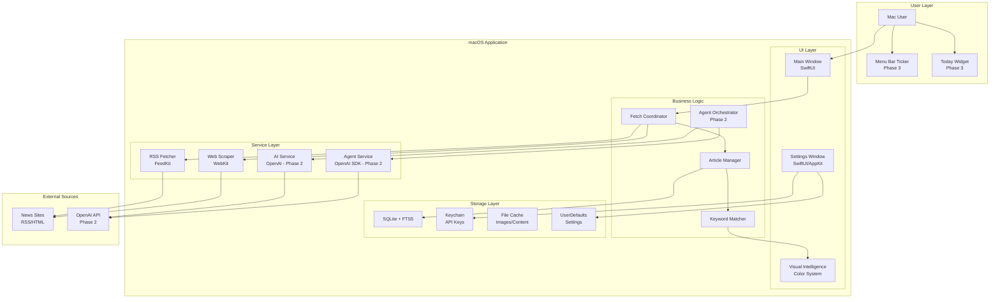
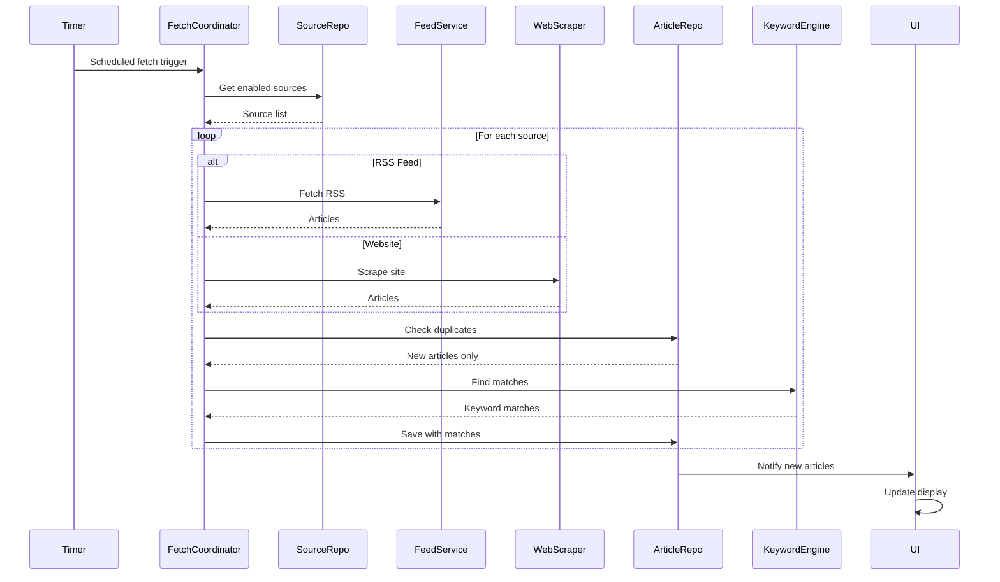
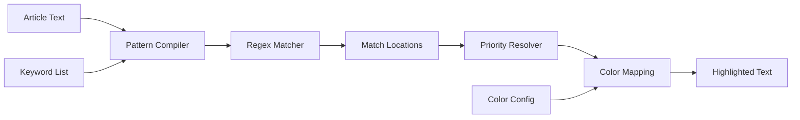
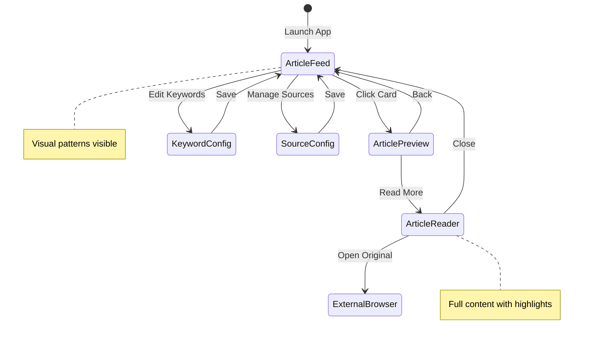
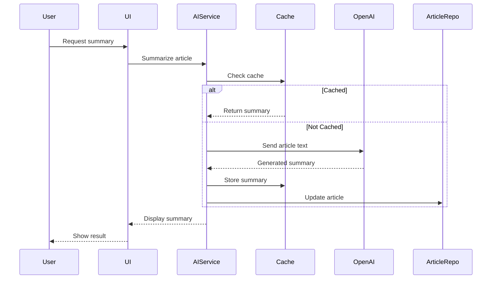
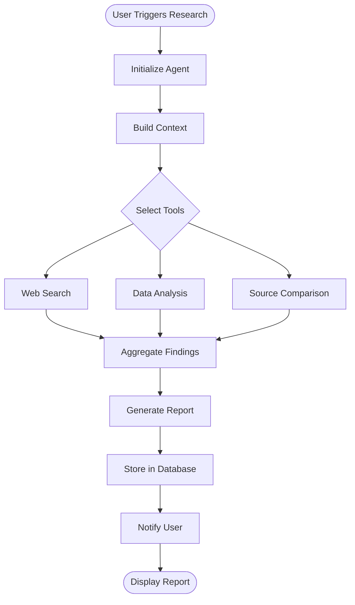
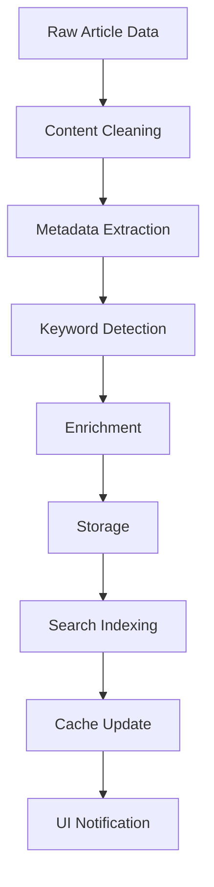
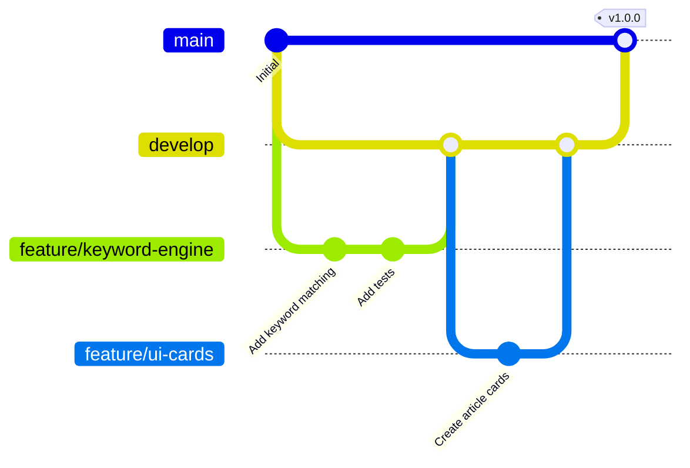
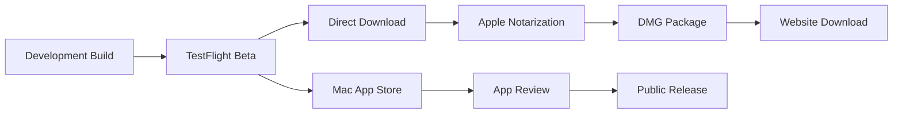

# Desktop News Aggregator Fullstack Architecture Document

## Introduction

This document outlines the complete fullstack architecture for Desktop News Aggregator, including backend systems, frontend implementation, and their integration. It serves as the single source of truth for AI-driven development, ensuring consistency across the entire technology stack.

This unified approach combines what would traditionally be separate backend and frontend architecture documents, streamlining the development process for modern fullstack applications where these concerns are increasingly intertwined.

### Starter Template or Existing Project

N/A - Greenfield project. This is a new native macOS application built from scratch using Swift/SwiftUI with no existing codebase or starter template constraints.

### Change Log

| Date | Version | Description | Author |
|------|---------|-------------|--------|
| 2025-08-06 | 1.0 | Initial architecture document creation | Winston (Architect) |
| 2025-08-06 | 1.1 | Completed all sections with full specifications | Winston (Architect) |

## High Level Architecture

### Technical Summary

The Desktop News Aggregator employs a monolithic native macOS architecture using Swift/SwiftUI, designed for rapid MVP delivery within 2-3 weeks. The application fetches content from 10-15 news sources via RSS/web scraping, stores articles in local SQLite with FTS5 for full-text search, and presents them through a card-based UI with proprietary color-coded keyword visualization. The architecture prioritizes local processing and storage for the MVP, with clear extension points for OpenAI integration and agent capabilities in Phase 2. This approach achieves the PRD goals of reducing news consumption time by 60% through instant visual pattern recognition while maintaining native performance on both Intel and Apple Silicon Macs.

### Platform and Infrastructure Choice

**Platform:** Local macOS Application (MVP), Local + Cloud Hybrid (Phase 2)
**Key Services:** 
- MVP: Local SQLite, File System Storage, macOS Keychain
- Phase 2: OpenAI API for summarization, OpenAI Agents SDK for research
- Phase 3: CloudKit for sync, App Store Connect for distribution
**Deployment Host and Regions:** Direct download (MVP), Mac App Store (Phase 3), Single binary distribution

### Repository Structure

**Structure:** Monorepo
**Monorepo Tool:** Xcode workspace with Swift Package Manager
**Package Organization:** 
- Single Xcode project with logical folder structure
- Core/ (business logic, models, data access)
- UI/ (SwiftUI views, AppKit components)
- Services/ (fetching, parsing, AI integration)
- Storage/ (SQLite, caching, persistence)
- Utilities/ (shared helpers, extensions)

### High Level Architecture Diagram



### Architectural Patterns

- **Monolithic Architecture:** Single macOS application bundle with modular internal structure - *Rationale:* Simplifies deployment and reduces complexity for solo developer MVP
- **MVVM Pattern:** Model-View-ViewModel with Combine for reactive updates - *Rationale:* Native SwiftUI pattern ensuring clean separation of concerns and testability
- **Repository Pattern:** Abstract data access through protocol-based repositories - *Rationale:* Enables future migration from SQLite to Core Data or CloudKit without UI changes
- **Coordinator Pattern:** Centralized fetch orchestration and navigation - *Rationale:* Manages complex async operations and maintains single responsibility principle
- **Observer Pattern:** Combine publishers for real-time UI updates - *Rationale:* Efficient propagation of article updates and keyword matches across views
- **Strategy Pattern:** Source-specific fetchers (RSS, Web, API) behind common protocol - *Rationale:* Extensible architecture for adding new source types without modifying core logic
- **Facade Pattern:** Simplified AI service interface hiding OpenAI complexity - *Rationale:* Isolates AI implementation details and enables easy model switching
- **Decorator Pattern:** Keyword highlighting as view modifier - *Rationale:* Reusable highlighting logic across different text components

## Tech Stack

This is the DEFINITIVE technology selection for the entire project. All development must use these exact versions and technologies.

### Technology Stack Table

| Category | Technology | Version | Purpose | Rationale |
|----------|------------|---------|---------|-----------|
| Frontend Language | Swift | 5.9+ | Native macOS UI development | Type-safe, performant, first-class Apple platform support |
| Frontend Framework | SwiftUI + AppKit | macOS 11+ | Modern declarative UI with fallbacks | SwiftUI for modern components, AppKit for advanced features unavailable in SwiftUI |
| UI Component Library | Native macOS | System | System-native components | Ensures consistent macOS look and feel, automatic dark mode support |
| State Management | Combine + @Published | iOS 13+ | Reactive data flow | Native Apple framework, perfect SwiftUI integration, no external dependencies |
| Backend Language | Swift | 5.9+ | Local data processing and services | Same language across stack, optimal for macOS integration |
| Backend Framework | Foundation + Concurrency | macOS 11+ | Async operations and networking | Modern Swift concurrency with async/await, backwards compatible with completion handlers |
| API Style | Local Services | N/A | Internal service protocols | No external API for MVP, protocols enable future remote APIs |
| Database | SQLite | 3.39+ | Local article storage | Embedded, zero-config, excellent FTS5 full-text search capabilities |
| Cache | NSCache + File System | System | Image and content caching | Native memory-aware caching with automatic purging under pressure |
| File Storage | ~/Library/Application Support | System | Article cache and user data | Standard macOS location, Time Machine compatible |
| Authentication | macOS Keychain | System | API key storage (Phase 2) | Secure credential storage with biometric protection |
| Frontend Testing | XCTest | Xcode 15+ | Unit and UI testing | Native Apple testing framework with Xcode integration |
| Backend Testing | XCTest | Xcode 15+ | Service and logic testing | Same framework for consistency, async testing support |
| E2E Testing | XCUITest | Xcode 15+ | End-to-end UI automation | Native UI testing with accessibility integration |
| Build Tool | Xcode Build System | 15.0+ | Compilation and packaging | Standard Apple toolchain, notarization support |
| Bundler | Swift Package Manager | 5.9+ | Dependency management | Native package management, no external tools needed |
| IaC Tool | N/A | N/A | Local app, no infrastructure | Desktop application requires no cloud infrastructure |
| CI/CD | Xcode Cloud | Optional | Automated builds (Phase 3) | Apple's native CI/CD, Mac App Store integration |
| Monitoring | os_log + Console | System | Logging and diagnostics | Native unified logging with streaming and filtering |
| Logging | OSLog | System | Structured logging | Performance-optimized, privacy-preserving logging |
| CSS Framework | N/A | N/A | Native UI styling | SwiftUI modifiers and AppKit appearance APIs |

### Additional Technology Choices

**Third-Party Dependencies (via SPM):**
- **FeedKit** (4.1+) - RSS/Atom feed parsing
- **SwiftSoup** (2.6+) - HTML parsing for web scraping
- **SQLite.swift** (0.14+) - Type-safe SQLite wrapper

**Phase 2 AI Integration:**
- **OpenAI Swift Client** (custom wrapper) - API communication
- **OpenAI Agents SDK** (Swift bindings) - Agent orchestration
- **Model:** gpt-4.1-mini exclusively for cost optimization

**Development Tools:**
- **Xcode** 15.0+ - Primary IDE
- **SwiftLint** 0.54+ - Code consistency
- **Instruments** - Performance profiling
- **Reality Composer Pro** (Phase 3) - visionOS widgets

## Data Models

Define the core data models/entities that will be shared between frontend and backend components of the macOS application.

### Article

**Purpose:** Core entity representing a news article fetched from any source with associated metadata and keyword matches

**Key Attributes:**
- `id`: UUID - Unique identifier for the article
- `sourceId`: String - Reference to the source this article came from
- `url`: String - Original article URL for click-through
- `title`: String - Article headline for display
- `summary`: String? - AI-generated or extracted summary (2 lines)
- `content`: String? - Full article content for search and analysis
- `publishedDate`: Date - When the article was originally published
- `fetchedDate`: Date - When we fetched this article
- `imageUrl`: String? - Thumbnail image for visual enhancement
- `keywordMatches`: [KeywordMatch] - Detected keyword occurrences
- `readStatus`: ReadStatus - Unread, scanned, or read
- `aiSummary`: String? - Cached OpenAI-generated summary
- `aiSummaryDate`: Date? - When the AI summary was generated

#### TypeScript Interface
```swift
struct Article: Identifiable, Codable {
    let id: UUID
    let sourceId: String
    let url: String
    let title: String
    var summary: String?
    let content: String?
    let publishedDate: Date
    let fetchedDate: Date
    let imageUrl: String?
    var keywordMatches: [KeywordMatch]
    var readStatus: ReadStatus
    var aiSummary: String?
    var aiSummaryDate: Date?
    
    enum ReadStatus: String, Codable {
        case unread, scanned, read
    }
}
```

#### Relationships
- Many-to-One with Source (each article belongs to one source)
- Many-to-Many with Keywords (through KeywordMatch)
- One-to-Many with ResearchReports (Phase 2)

### Source

**Purpose:** Represents a news source configuration including fetch method and metadata

**Key Attributes:**
- `id`: UUID - Unique identifier
- `name`: String - Display name (e.g., "TechCrunch")
- `url`: String - Base URL or feed URL
- `type`: SourceType - RSS, website, or API
- `enabled`: Bool - Whether to include in fetches
- `lastFetchDate`: Date? - Last successful fetch
- `lastFetchError`: String? - Last error message if failed
- `fetchInterval`: TimeInterval - Custom fetch frequency
- `priority`: Int - Ordering and fetch priority
- `selectors`: WebSelectors? - CSS/XPath for web scraping

#### TypeScript Interface
```swift
struct Source: Identifiable, Codable {
    let id: UUID
    var name: String
    var url: String
    var type: SourceType
    var enabled: Bool
    var lastFetchDate: Date?
    var lastFetchError: String?
    var fetchInterval: TimeInterval
    var priority: Int
    var selectors: WebSelectors?
    
    enum SourceType: String, Codable {
        case rss, website, api
    }
    
    struct WebSelectors: Codable {
        let titleSelector: String
        let contentSelector: String
        let dateSelector: String?
        let imageSelector: String?
    }
}
```

#### Relationships
- One-to-Many with Articles (source has many articles)
- Many-to-Many with KeywordProfiles (Phase 2)

### Keyword

**Purpose:** User-configured keyword with associated color for visual pattern recognition

**Key Attributes:**
- `id`: UUID - Unique identifier
- `term`: String - The keyword or phrase to match
- `pattern`: String - Regex pattern for matching
- `color`: Color - RGB color for highlighting
- `priority`: Int - Resolution order for overlapping matches
- `caseSensitive`: Bool - Whether matching is case-sensitive
- `wholeWord`: Bool - Match whole words only
- `profileId`: UUID? - Associated profile (Phase 2)
- `createdDate`: Date - When keyword was added
- `matchCount`: Int - Total historical matches

#### TypeScript Interface
```swift
struct Keyword: Identifiable, Codable {
    let id: UUID
    var term: String
    var pattern: String
    var color: CodableColor
    var priority: Int
    var caseSensitive: Bool
    var wholeWord: Bool
    var profileId: UUID?
    let createdDate: Date
    var matchCount: Int
    
    struct CodableColor: Codable {
        let red: Double
        let green: Double
        let blue: Double
        let alpha: Double
    }
}
```

#### Relationships
- Many-to-Many with Articles (through KeywordMatch)
- Many-to-One with KeywordProfile (Phase 2)

### KeywordMatch

**Purpose:** Junction entity tracking specific keyword occurrences within articles

**Key Attributes:**
- `id`: UUID - Unique identifier
- `articleId`: UUID - Reference to article
- `keywordId`: UUID - Reference to keyword
- `locations`: [TextRange] - Where matches occur in text
- `matchCount`: Int - Number of occurrences
- `context`: String - Snippet around match for preview

#### TypeScript Interface
```swift
struct KeywordMatch: Identifiable, Codable {
    let id: UUID
    let articleId: UUID
    let keywordId: UUID
    var locations: [TextRange]
    var matchCount: Int
    var context: String
    
    struct TextRange: Codable {
        let start: Int
        let end: Int
        let field: Field
        
        enum Field: String, Codable {
            case title, summary, content
        }
    }
}
```

#### Relationships
- Many-to-One with Article
- Many-to-One with Keyword

### UserSettings

**Purpose:** Application preferences and configuration persisted across sessions

**Key Attributes:**
- `id`: UUID - Unique identifier
- `fetchSchedule`: [FetchTime] - Configured fetch times
- `viewMode`: ViewMode - Current display mode
- `articleRetention`: TimeInterval - How long to keep articles
- `maxArticlesPerSource`: Int - Limit per source
- `enableAISummaries`: Bool - Phase 2 feature flag
- `openAIKey`: String? - Encrypted API key (Phase 2)
- `colorScheme`: ColorScheme - Light, dark, or auto

#### TypeScript Interface
```swift
struct UserSettings: Codable {
    let id: UUID
    var fetchSchedule: [FetchTime]
    var viewMode: ViewMode
    var articleRetention: TimeInterval
    var maxArticlesPerSource: Int
    var enableAISummaries: Bool
    var openAIKey: String?
    var colorScheme: ColorScheme
    
    struct FetchTime: Codable {
        let hour: Int
        let minute: Int
        let enabled: Bool
    }
    
    enum ViewMode: String, Codable {
        case focus, compact, reader, executive
    }
    
    enum ColorScheme: String, Codable {
        case light, dark, auto
    }
}
```

#### Relationships
- One-to-One with User (implicit single user)
- One-to-Many with KeywordProfiles (Phase 2)

## API Specification

Since this is a native macOS application with no external API for MVP, this section defines the internal service protocols and the future local REST API for agent integration.

### Internal Service Protocols (MVP)

The application uses protocol-based service architecture for clean separation of concerns:

```swift
// MARK: - Article Fetching Services

protocol ArticleFetchService {
    func fetchArticles(from source: Source) async throws -> [Article]
    func fetchAll(sources: [Source]) async -> [FetchResult]
}

protocol RSSFeedService: ArticleFetchService {
    func parseFeed(at url: URL) async throws -> [Article]
}

protocol WebScrapingService: ArticleFetchService {
    func scrapeArticles(from url: URL, selectors: Source.WebSelectors) async throws -> [Article]
}

// MARK: - Data Persistence Services

protocol ArticleRepository {
    func save(_ article: Article) async throws
    func fetch(matching keywords: [Keyword]) async throws -> [Article]
    func fetchRecent(limit: Int) async throws -> [Article]
    func markAsRead(_ articleId: UUID) async throws
    func deleteOlderThan(_ date: Date) async throws -> Int
}

protocol SourceRepository {
    func save(_ source: Source) async throws
    func fetchAll() async throws -> [Source]
    func update(_ source: Source) async throws
    func delete(_ sourceId: UUID) async throws
}

protocol KeywordRepository {
    func save(_ keyword: Keyword) async throws
    func fetchAll() async throws -> [Keyword]
    func updateMatchCount(for keywordId: UUID, increment: Int) async throws
}

// MARK: - Keyword Processing Services

protocol KeywordMatchingService {
    func findMatches(in article: Article, keywords: [Keyword]) -> [KeywordMatch]
    func highlight(text: String, with keywords: [Keyword]) -> NSAttributedString
}

// MARK: - AI Services (Phase 2)

protocol SummarizationService {
    func summarize(_ article: Article) async throws -> String
    func summarizeBatch(_ articles: [Article]) async throws -> [String]
}

protocol AgentService {
    func research(article: Article) async throws -> ResearchReport
    func generateBrief(articles: [Article]) async throws -> IntelligenceBrief
    func suggestKeywords(from articles: [Article]) async throws -> [Keyword]
}
```

### Local REST API Specification (Phase 2)

For agent integration and future extensibility, a local REST API will be exposed:

```yaml
openapi: 3.0.0
info:
  title: Desktop News Aggregator Local API
  version: 1.0.0
  description: Local API for agent integration and external tool access
servers:
  - url: http://localhost:8765
    description: Local development server

paths:
  /api/articles:
    get:
      summary: Retrieve articles with optional filters
      parameters:
        - name: keywords
          in: query
          schema:
            type: array
            items:
              type: string
        - name: sources
          in: query
          schema:
            type: array
            items:
              type: string
        - name: since
          in: query
          schema:
            type: string
            format: date-time
        - name: limit
          in: query
          schema:
            type: integer
            default: 100
      responses:
        '200':
          description: List of articles
          content:
            application/json:
              schema:
                type: array
                items:
                  $ref: '#/components/schemas/Article'
    
  /api/articles/{id}:
    get:
      summary: Get specific article by ID
      parameters:
        - name: id
          in: path
          required: true
          schema:
            type: string
      responses:
        '200':
          description: Article details
          content:
            application/json:
              schema:
                $ref: '#/components/schemas/Article'
    
  /api/articles/{id}/research:
    post:
      summary: Trigger AI research on article
      parameters:
        - name: id
          in: path
          required: true
          schema:
            type: string
      requestBody:
        content:
          application/json:
            schema:
              type: object
              properties:
                depth:
                  type: string
                  enum: [quick, standard, deep]
                focus:
                  type: array
                  items:
                    type: string
      responses:
        '202':
          description: Research initiated
          content:
            application/json:
              schema:
                type: object
                properties:
                  taskId:
                    type: string
                  estimatedTime:
                    type: integer
  
  /api/keywords:
    get:
      summary: List all configured keywords
      responses:
        '200':
          description: Keyword list
          content:
            application/json:
              schema:
                type: array
                items:
                  $ref: '#/components/schemas/Keyword'
    
    post:
      summary: Add new keyword
      requestBody:
        content:
          application/json:
            schema:
              $ref: '#/components/schemas/Keyword'
      responses:
        '201':
          description: Keyword created
  
  /api/sources:
    get:
      summary: List all configured sources
      responses:
        '200':
          description: Source list
          content:
            application/json:
              schema:
                type: array
                items:
                  $ref: '#/components/schemas/Source'
    
    post:
      summary: Add new source
      requestBody:
        content:
          application/json:
            schema:
              $ref: '#/components/schemas/Source'
      responses:
        '201':
          description: Source created
  
  /api/search:
    post:
      summary: Full-text search across articles
      requestBody:
        content:
          application/json:
            schema:
              type: object
              properties:
                query:
                  type: string
                filters:
                  type: object
                limit:
                  type: integer
      responses:
        '200':
          description: Search results
          content:
            application/json:
              schema:
                type: array
                items:
                  $ref: '#/components/schemas/Article'
  
  /api/intelligence/brief:
    post:
      summary: Generate AI intelligence brief
      requestBody:
        content:
          application/json:
            schema:
              type: object
              properties:
                timeRange:
                  type: string
                  enum: [today, week, month]
                keywords:
                  type: array
                  items:
                    type: string
      responses:
        '200':
          description: Generated brief
          content:
            application/json:
              schema:
                $ref: '#/components/schemas/IntelligenceBrief'

components:
  schemas:
    Article:
      type: object
      properties:
        id:
          type: string
        sourceId:
          type: string
        url:
          type: string
        title:
          type: string
        summary:
          type: string
        content:
          type: string
        publishedDate:
          type: string
          format: date-time
        keywordMatches:
          type: array
          items:
            $ref: '#/components/schemas/KeywordMatch'
    
    Keyword:
      type: object
      properties:
        id:
          type: string
        term:
          type: string
        color:
          type: object
          properties:
            red:
              type: number
            green:
              type: number
            blue:
              type: number
    
    Source:
      type: object
      properties:
        id:
          type: string
        name:
          type: string
        url:
          type: string
        type:
          type: string
          enum: [rss, website, api]
    
    KeywordMatch:
      type: object
      properties:
        keywordId:
          type: string
        locations:
          type: array
          items:
            type: object
            properties:
              start:
                type: integer
              end:
                type: integer
              field:
                type: string
    
    IntelligenceBrief:
      type: object
      properties:
        id:
          type: string
        generatedAt:
          type: string
          format: date-time
        headlines:
          type: array
          items:
            type: string
        trends:
          type: array
          items:
            type: object
        keyInsights:
          type: array
          items:
            type: string
```

## Components

Based on the architectural patterns, tech stack, and data models, here are the major logical components across the application.

### UI Components

#### MainWindowView
**Purpose:** Primary application window containing article feed and navigation
**Responsibilities:**
- Display article cards in scrollable feed
- Handle view mode transitions (Focus, Compact, Reader, Executive)
- Coordinate keyword highlighting across all visible text
- Manage real-time updates via Combine subscriptions
**Key Interactions:** ArticleCardView, NavigationSidebar, KeywordToolbar, SearchBar

#### ArticleCardView
**Purpose:** Individual article display component with visual intelligence features
**Responsibilities:**
- Render article preview with title, summary, and metadata
- Apply keyword color highlighting in real-time
- Handle tap/click interactions for article expansion
- Display match count badges and source indicators
**Key Interactions:** KeywordHighlighter, ArticleDetailView, ShareMenu

#### KeywordConfigurationView
**Purpose:** Interface for managing keywords and color assignments
**Responsibilities:**
- Add/edit/delete keywords with regex pattern support
- Color picker integration for visual mapping
- Live preview of keyword highlighting
- Import/export keyword sets
**Key Interactions:** KeywordRepository, ColorPicker, RegexValidator

#### SourceManagementView
**Purpose:** Configure and monitor news sources
**Responsibilities:**
- Add RSS feeds and website sources
- Configure fetch schedules per source
- Display source health and last fetch status
- Test source connectivity and parsing
**Key Interactions:** SourceRepository, FetchCoordinator, SourceValidator

#### ExecutiveDashboardView
**Purpose:** High-level intelligence view for Phase 2
**Responsibilities:**
- Display AI-generated intelligence briefs
- Show trending keywords and patterns
- Visualize article velocity and sentiment
- Present research reports and insights
**Key Interactions:** AgentService, ChartView, IntelligenceBriefView

### Service Components

#### FetchCoordinator
**Purpose:** Orchestrate article fetching from multiple sources
**Responsibilities:**
- Schedule and execute fetch operations
- Manage concurrent source fetches
- Handle rate limiting and retries
- Update source status and error tracking
**Key Interactions:** RSSFeedService, WebScrapingService, ArticleRepository

#### RSSFeedService
**Purpose:** Parse and process RSS/Atom feeds
**Responsibilities:**
- Fetch and parse RSS/Atom XML
- Extract article metadata and content
- Handle feed encoding and format variations
- Validate feed structure and content
**Key Interactions:** FeedKit, NetworkService, ArticleFactory

#### WebScrapingService
**Purpose:** Extract articles from websites without feeds
**Responsibilities:**
- Load web pages using WebKit
- Apply CSS/XPath selectors for content extraction
- Handle JavaScript-rendered content
- Clean and normalize extracted HTML
**Key Interactions:** WebKit, SwiftSoup, ContentCleaner

#### KeywordMatchingEngine
**Purpose:** High-performance keyword detection and highlighting
**Responsibilities:**
- Compile and cache regex patterns
- Find all keyword matches in article text
- Resolve overlapping matches by priority
- Generate highlighted text ranges
**Key Interactions:** KeywordRepository, TextProcessor, HighlightCache

#### AIIntegrationService (Phase 2)
**Purpose:** Interface with OpenAI for summarization and analysis
**Responsibilities:**
- Manage API authentication and rate limiting
- Send articles for summarization
- Cache AI responses for cost optimization
- Handle API errors and fallbacks
**Key Interactions:** OpenAI API, TokenCounter, ResponseCache

#### AgentOrchestrator (Phase 2)
**Purpose:** Coordinate autonomous research agents
**Responsibilities:**
- Spawn and manage research agents
- Coordinate multi-step research workflows
- Aggregate agent findings into reports
- Manage agent conversation context
**Key Interactions:** OpenAI Agents SDK, ResearchRepository, ToolRegistry

### Data Access Components

#### SQLiteManager
**Purpose:** Core database connection and query management
**Responsibilities:**
- Manage database connections and transactions
- Execute migrations and schema updates
- Handle connection pooling
- Provide query builder interface
**Key Interactions:** SQLite.swift, MigrationManager, QueryBuilder

#### ArticleRepository
**Purpose:** Article persistence and retrieval
**Responsibilities:**
- CRUD operations for articles
- Full-text search via FTS5
- Batch operations for performance
- Automatic cleanup of old articles
**Key Interactions:** SQLiteManager, ArticleCache, SearchIndex

#### KeywordRepository
**Purpose:** Keyword configuration persistence
**Responsibilities:**
- Store keyword patterns and colors
- Track match statistics
- Manage keyword profiles (Phase 2)
- Export/import keyword sets
**Key Interactions:** SQLiteManager, KeywordValidator, ProfileManager

#### SourceRepository
**Purpose:** News source configuration storage
**Responsibilities:**
- Persist source configurations
- Track fetch history and errors
- Store scraping selectors
- Manage source priorities
**Key Interactions:** SQLiteManager, SourceValidator, FetchScheduler

#### CacheManager
**Purpose:** Multi-level caching for performance
**Responsibilities:**
- Memory cache for hot data
- Disk cache for images and content
- Cache invalidation strategies
- Size and age-based eviction
**Key Interactions:** NSCache, FileManager, CachePolicy

### Supporting Components

#### NetworkManager
**Purpose:** Centralized network operations
**Responsibilities:**
- HTTP request execution
- Connection monitoring
- Request queuing and retry
- Certificate pinning (Phase 3)
**Key Interactions:** URLSession, Reachability, RequestQueue

#### MigrationManager
**Purpose:** Database schema evolution
**Responsibilities:**
- Track schema versions
- Execute migration scripts
- Handle rollback on failure
- Validate migration integrity
**Key Interactions:** SQLiteManager, MigrationScript, VersionTracker

#### NotificationService
**Purpose:** User notifications and alerts
**Responsibilities:**
- New article notifications
- Keyword match alerts
- Fetch error notifications
- System tray updates
**Key Interactions:** UserNotifications, NotificationCenter, TrayManager

#### AnalyticsEngine
**Purpose:** Usage tracking and insights
**Responsibilities:**
- Track feature usage
- Monitor performance metrics
- Generate usage reports
- Privacy-preserving analytics
**Key Interactions:** OSLog, MetricsCollector, ReportGenerator

## External APIs

Since this is a native macOS application for MVP, external API integrations are minimal initially, expanding significantly in Phase 2.

### MVP Phase - News Sources Only

#### RSS/Atom Feeds
**Purpose:** Primary content source for most news sites
**Endpoints:** Site-specific RSS URLs (e.g., https://techcrunch.com/feed/)
**Authentication:** None required for public feeds
**Rate Limits:** Respect site-specific crawl delays (typically 5-15 minutes)
**Data Format:** XML (RSS 2.0, Atom 1.0)
**Error Handling:** Fallback to cached content, exponential backoff on failures

#### Website HTML (Scraping)
**Purpose:** Fallback for sites without RSS feeds
**Method:** Direct HTML fetching with WebKit
**Authentication:** None (public content only)
**Rate Limits:** Minimum 30-second delay between requests per domain
**Data Format:** HTML with site-specific selectors
**Compliance:** Respect robots.txt, identify with proper User-Agent

### Phase 2 - AI Integration

#### OpenAI API
**Purpose:** Article summarization and intelligence generation
**Base URL:** https://api.openai.com/v1
**Authentication:** Bearer token via API key
**Model:** gpt-4.1-mini (cost-optimized)
**Rate Limits:** 10,000 TPM, 50 RPM for tier 1
**Endpoints Used:**
- `/chat/completions` - Summarization and analysis
- `/embeddings` - Semantic search (future)

**Request Example:**
```swift
struct OpenAIRequest: Codable {
    let model: String = "gpt-4.1-mini"
    let messages: [Message]
    let temperature: Double = 0.3
    let max_tokens: Int = 150
    
    struct Message: Codable {
        let role: String
        let content: String
    }
}
```

**Cost Management:**
- Cache all responses indefinitely
- Batch similar articles for single prompts
- Use streaming for long-form content
- Implement token counting before requests

#### OpenAI Agents API
**Purpose:** Autonomous research and deep analysis
**Authentication:** Same as OpenAI API
**Capabilities:**
- Web browsing for fact-checking
- Code interpretation for data analysis
- File handling for report generation

**Agent Configuration:**
```swift
struct AgentConfig {
    let name: String = "NewsResearcher"
    let instructions: String = "Research and analyze news articles for deeper insights"
    let tools: [String] = ["web_browser", "code_interpreter"]
    let model: String = "gpt-4.1-mini"
}
```

### Phase 3 - Platform Services

#### CloudKit
**Purpose:** Cross-device synchronization
**Authentication:** iCloud account
**Containers:** Private database only
**Record Types:** Article, Keyword, Source, Settings
**Sync Strategy:** Differential sync with conflict resolution

#### Mac App Store Connect API
**Purpose:** Distribution and analytics
**Authentication:** App Store Connect API key
**Usage:** Automated builds, crash reports, usage analytics

## Core Workflows

### Article Fetch Workflow



### Keyword Matching Workflow



### User Reading Flow



### AI Summarization Workflow (Phase 2)



### Research Agent Workflow (Phase 2)



## Database Schema

### SQLite Database Structure

```sql
-- Enable Foreign Keys
PRAGMA foreign_keys = ON;

-- Enable FTS5 Extension
-- Loaded at runtime via SQLite.swift

-- Sources Table
CREATE TABLE sources (
    id TEXT PRIMARY KEY,
    name TEXT NOT NULL,
    url TEXT NOT NULL UNIQUE,
    type TEXT NOT NULL CHECK(type IN ('rss', 'website', 'api')),
    enabled INTEGER NOT NULL DEFAULT 1,
    last_fetch_date INTEGER,
    last_fetch_error TEXT,
    fetch_interval INTEGER NOT NULL DEFAULT 900,
    priority INTEGER NOT NULL DEFAULT 0,
    selectors TEXT, -- JSON for web scraping selectors
    created_at INTEGER NOT NULL,
    updated_at INTEGER NOT NULL
);

CREATE INDEX idx_sources_enabled ON sources(enabled);
CREATE INDEX idx_sources_priority ON sources(priority DESC);

-- Articles Table
CREATE TABLE articles (
    id TEXT PRIMARY KEY,
    source_id TEXT NOT NULL,
    url TEXT NOT NULL UNIQUE,
    title TEXT NOT NULL,
    summary TEXT,
    content TEXT,
    published_date INTEGER NOT NULL,
    fetched_date INTEGER NOT NULL,
    image_url TEXT,
    read_status TEXT NOT NULL DEFAULT 'unread' CHECK(read_status IN ('unread', 'scanned', 'read')),
    ai_summary TEXT,
    ai_summary_date INTEGER,
    created_at INTEGER NOT NULL,
    updated_at INTEGER NOT NULL,
    FOREIGN KEY (source_id) REFERENCES sources(id) ON DELETE CASCADE
);

CREATE INDEX idx_articles_source ON articles(source_id);
CREATE INDEX idx_articles_published ON articles(published_date DESC);
CREATE INDEX idx_articles_fetched ON articles(fetched_date DESC);
CREATE INDEX idx_articles_read_status ON articles(read_status);

-- Full-Text Search Virtual Table
CREATE VIRTUAL TABLE articles_fts USING fts5(
    title,
    summary,
    content,
    content=articles,
    content_rowid=rowid,
    tokenize='porter unicode61'
);

-- Triggers to keep FTS in sync
CREATE TRIGGER articles_ai AFTER INSERT ON articles BEGIN
    INSERT INTO articles_fts(rowid, title, summary, content)
    VALUES (new.rowid, new.title, new.summary, new.content);
END;

CREATE TRIGGER articles_ad AFTER DELETE ON articles BEGIN
    DELETE FROM articles_fts WHERE rowid = old.rowid;
END;

CREATE TRIGGER articles_au AFTER UPDATE ON articles BEGIN
    UPDATE articles_fts SET 
        title = new.title,
        summary = new.summary,
        content = new.content
    WHERE rowid = new.rowid;
END;

-- Keywords Table
CREATE TABLE keywords (
    id TEXT PRIMARY KEY,
    term TEXT NOT NULL,
    pattern TEXT NOT NULL,
    color_red REAL NOT NULL,
    color_green REAL NOT NULL,
    color_blue REAL NOT NULL,
    color_alpha REAL NOT NULL DEFAULT 1.0,
    priority INTEGER NOT NULL DEFAULT 0,
    case_sensitive INTEGER NOT NULL DEFAULT 0,
    whole_word INTEGER NOT NULL DEFAULT 0,
    profile_id TEXT,
    created_date INTEGER NOT NULL,
    match_count INTEGER NOT NULL DEFAULT 0,
    created_at INTEGER NOT NULL,
    updated_at INTEGER NOT NULL
);

CREATE INDEX idx_keywords_priority ON keywords(priority DESC);
CREATE INDEX idx_keywords_profile ON keywords(profile_id);

-- Keyword Matches Junction Table
CREATE TABLE keyword_matches (
    id TEXT PRIMARY KEY,
    article_id TEXT NOT NULL,
    keyword_id TEXT NOT NULL,
    locations TEXT NOT NULL, -- JSON array of match locations
    match_count INTEGER NOT NULL,
    context TEXT,
    created_at INTEGER NOT NULL,
    FOREIGN KEY (article_id) REFERENCES articles(id) ON DELETE CASCADE,
    FOREIGN KEY (keyword_id) REFERENCES keywords(id) ON DELETE CASCADE
);

CREATE INDEX idx_matches_article ON keyword_matches(article_id);
CREATE INDEX idx_matches_keyword ON keyword_matches(keyword_id);
CREATE UNIQUE INDEX idx_matches_unique ON keyword_matches(article_id, keyword_id);

-- User Settings Table (Single Row)
CREATE TABLE user_settings (
    id TEXT PRIMARY KEY DEFAULT 'main',
    fetch_schedule TEXT NOT NULL, -- JSON array of fetch times
    view_mode TEXT NOT NULL DEFAULT 'focus',
    article_retention INTEGER NOT NULL DEFAULT 604800, -- 7 days in seconds
    max_articles_per_source INTEGER NOT NULL DEFAULT 50,
    enable_ai_summaries INTEGER NOT NULL DEFAULT 0,
    openai_key TEXT, -- Encrypted
    color_scheme TEXT NOT NULL DEFAULT 'auto',
    created_at INTEGER NOT NULL,
    updated_at INTEGER NOT NULL,
    CHECK (id = 'main') -- Ensure single row
);

-- Research Reports Table (Phase 2)
CREATE TABLE research_reports (
    id TEXT PRIMARY KEY,
    article_id TEXT NOT NULL,
    agent_id TEXT,
    report_type TEXT NOT NULL,
    content TEXT NOT NULL,
    metadata TEXT, -- JSON
    created_at INTEGER NOT NULL,
    FOREIGN KEY (article_id) REFERENCES articles(id) ON DELETE CASCADE
);

CREATE INDEX idx_reports_article ON research_reports(article_id);
CREATE INDEX idx_reports_created ON research_reports(created_at DESC);

-- Migration Tracking
CREATE TABLE schema_migrations (
    version INTEGER PRIMARY KEY,
    applied_at INTEGER NOT NULL
);

-- Initial Data
INSERT INTO user_settings (
    id, fetch_schedule, view_mode, article_retention,
    max_articles_per_source, enable_ai_summaries, color_scheme,
    created_at, updated_at
) VALUES (
    'main',
    '[{"hour":8,"minute":0,"enabled":true},{"hour":12,"minute":0,"enabled":true},{"hour":18,"minute":0,"enabled":true}]',
    'focus',
    604800,
    50,
    0,
    'auto',
    strftime('%s', 'now'),
    strftime('%s', 'now')
);
```

### Database Access Patterns

**High-Frequency Queries:**
- Fetch recent articles with keyword matches (main feed)
- Full-text search across articles
- Keyword match detection for new articles
- Source status checks for scheduling

**Optimization Strategies:**
- Prepared statements for all queries
- Connection pooling (3 connections)
- In-memory cache for keywords
- Batch inserts for articles
- Automatic VACUUM weekly

## Frontend Architecture

### SwiftUI View Architecture

```swift
// View Hierarchy
DesktopNewsAggregatorApp
├── MainWindow
│   ├── NavigationSplitView
│   │   ├── Sidebar
│   │   │   ├── SourceList
│   │   │   ├── KeywordList
│   │   │   └── ViewModeSelector
│   │   ├── ContentView
│   │   │   ├── ArticleFeed
│   │   │   │   └── ArticleCard[]
│   │   │   └── SearchBar
│   │   └── DetailView
│   │       └── ArticleReader
│   └── Toolbar
│       ├── RefreshButton
│       ├── ViewModeToggle
│       └── SettingsButton
├── SettingsWindow
│   ├── GeneralSettings
│   ├── SourcesSettings
│   ├── KeywordsSettings
│   └── AISettings (Phase 2)
└── MenuBarExtra (Phase 3)
    └── TickerView
```

### State Management Architecture

```swift
// MVVM with Combine
class AppState: ObservableObject {
    @Published var articles: [Article] = []
    @Published var keywords: [Keyword] = []
    @Published var sources: [Source] = []
    @Published var viewMode: ViewMode = .focus
    @Published var selectedArticle: Article?
    @Published var searchQuery: String = ""
    
    private var cancellables = Set<AnyCancellable>()
    
    init() {
        setupBindings()
        loadInitialData()
    }
}

class ArticleViewModel: ObservableObject {
    @Published var article: Article
    @Published var highlightedTitle: AttributedString
    @Published var highlightedSummary: AttributedString
    @Published var isLoadingAISummary: Bool = false
    
    private let keywordEngine: KeywordMatchingEngine
    private let aiService: AIIntegrationService?
    
    func loadAISummary() async { }
    func markAsRead() { }
    func share() { }
}
```

### Component Communication

```mermaid
graph LR
    AppState["@StateObject AppState"]
    ArticleFeed["ArticleFeedView"]
    ArticleCard["ArticleCardView"]
    KeywordConfig["KeywordConfigView"]
    
    AppState -->|@EnvironmentObject| ArticleFeed
    AppState -->|@EnvironmentObject| KeywordConfig
    ArticleFeed -->|@ObservedObject| ArticleCard
    
    ArticleCard -->|Binding| ArticleFeed
    KeywordConfig -->|Publisher| AppState
```

### View Modifiers and Styles

```swift
// Custom View Modifiers
struct KeywordHighlight: ViewModifier {
    let keywords: [Keyword]
    let text: String
    
    func body(content: Content) -> some View {
        content.overlay(
            HighlightedText(text: text, keywords: keywords)
        )
    }
}

// Design System
struct DesignSystem {
    static let cardCornerRadius: CGFloat = 12
    static let cardPadding: CGFloat = 16
    static let cardSpacing: CGFloat = 8
    static let animationDuration: TimeInterval = 0.25
    
    static let colors = Colors(
        primary: Color("AccentColor"),
        cardBackground: Color(NSColor.controlBackgroundColor),
        textPrimary: Color(NSColor.labelColor),
        textSecondary: Color(NSColor.secondaryLabelColor)
    )
}
```

### Performance Optimizations

**Rendering Performance:**
- LazyVStack for article feed
- Lazy loading of images
- View recycling with identifiable
- Debounced search with Combine
- Background keyword processing

**Memory Management:**
- Weak references in view models
- Image cache with size limits
- Automatic view model cleanup
- Pagination for large feeds

### Accessibility

```swift
struct ArticleCardView: View {
    var body: some View {
        VStack {
            // Content
        }
        .accessibilityElement(children: .combine)
        .accessibilityLabel(article.title)
        .accessibilityHint("Double tap to read article")
        .accessibilityAddTraits(.isButton)
        .accessibilityValue("\(article.keywordMatches.count) keyword matches")
    }
}
```

## Backend Architecture

### Service Layer Architecture

```swift
// Service Protocol Definitions
protocol ServiceProtocol {
    associatedtype Input
    associatedtype Output
    func execute(_ input: Input) async throws -> Output
}

// Dependency Injection Container
class ServiceContainer {
    static let shared = ServiceContainer()
    
    lazy var networkManager = NetworkManager()
    lazy var databaseManager = SQLiteManager()
    lazy var fetchCoordinator = FetchCoordinator()
    lazy var keywordEngine = KeywordMatchingEngine()
    lazy var cacheManager = CacheManager()
    
    // Repositories
    lazy var articleRepository = ArticleRepository(db: databaseManager)
    lazy var sourceRepository = SourceRepository(db: databaseManager)
    lazy var keywordRepository = KeywordRepository(db: databaseManager)
    
    // Services
    lazy var rssFeedService = RSSFeedService(network: networkManager)
    lazy var webScrapingService = WebScrapingService()
    lazy var aiService = AIIntegrationService() // Phase 2
}
```

### Concurrency Architecture

```swift
// Actor-based Concurrency Model
actor FetchCoordinator {
    private var activeFetches: Set<UUID> = []
    private let maxConcurrent = 5
    
    func fetchAllSources() async {
        let sources = await sourceRepository.getEnabled()
        
        await withTaskGroup(of: FetchResult.self) { group in
            for source in sources {
                group.addTask { [self] in
                    await self.fetchSource(source)
                }
            }
            
            for await result in group {
                await processResult(result)
            }
        }
    }
    
    private func fetchSource(_ source: Source) async -> FetchResult {
        // Rate limiting
        await rateLimiter.waitIfNeeded(for: source.url)
        
        switch source.type {
        case .rss:
            return await rssFeedService.fetch(source)
        case .website:
            return await webScrapingService.fetch(source)
        case .api:
            return .failure(NotImplementedError())
        }
    }
}
```

### Data Processing Pipeline



### Error Handling Architecture

```swift
enum AppError: LocalizedError {
    case network(NetworkError)
    case database(DatabaseError)
    case parsing(ParsingError)
    case ai(AIError)
    case validation(ValidationError)
    
    var errorDescription: String? {
        switch self {
        case .network(let error):
            return "Network error: \(error.localizedDescription)"
        case .database(let error):
            return "Database error: \(error.localizedDescription)"
        case .parsing(let error):
            return "Parsing error: \(error.localizedDescription)"
        case .ai(let error):
            return "AI service error: \(error.localizedDescription)"
        case .validation(let error):
            return "Validation error: \(error.localizedDescription)"
        }
    }
    
    var recoverySuggestion: String? {
        switch self {
        case .network:
            return "Check your internet connection and try again"
        case .database:
            return "Try restarting the application"
        case .parsing:
            return "The source format may have changed"
        case .ai:
            return "AI features temporarily unavailable"
        case .validation:
            return "Please check your input and try again"
        }
    }
}

// Result type for service operations
typealias ServiceResult<T> = Result<T, AppError>
```

### Background Task Management

```swift
class BackgroundTaskScheduler {
    private var tasks: [UUID: DispatchWorkItem] = [:]
    private let queue = DispatchQueue(label: "background.tasks", qos: .background)
    
    func scheduleFetch(at dates: [Date]) {
        for date in dates {
            let task = DispatchWorkItem { [weak self] in
                Task {
                    await self?.executeFetch()
                }
            }
            
            let delay = date.timeIntervalSinceNow
            if delay > 0 {
                queue.asyncAfter(deadline: .now() + delay, execute: task)
                tasks[UUID()] = task
            }
        }
    }
    
    func scheduleCleanup() {
        let task = DispatchWorkItem { [weak self] in
            Task {
                await self?.cleanOldArticles()
                await self?.vacuumDatabase()
                await self?.clearCache()
            }
        }
        
        // Run daily at 3 AM
        let calendar = Calendar.current
        let targetTime = calendar.dateComponents([.hour, .minute], from: Date(hour: 3, minute: 0))
        // Schedule recurring task
    }
}
```

### Caching Strategy

```swift
class CacheManager {
    // Three-tier caching
    private let memoryCache = NSCache<NSString, CacheEntry>()
    private let diskCache = DiskCache(directory: .caches)
    private let databaseCache: ArticleRepository
    
    func get<T: Codable>(_ key: String, type: T.Type) async -> T? {
        // L1: Memory
        if let cached = memoryCache.object(forKey: key as NSString) {
            return cached.value as? T
        }
        
        // L2: Disk
        if let data = await diskCache.read(key) {
            let decoded = try? JSONDecoder().decode(T.self, from: data)
            memoryCache.setObject(CacheEntry(decoded), forKey: key as NSString)
            return decoded
        }
        
        // L3: Database
        return nil
    }
    
    func set<T: Codable>(_ value: T, for key: String, ttl: TimeInterval = 3600) async {
        let entry = CacheEntry(value, ttl: ttl)
        memoryCache.setObject(entry, forKey: key as NSString)
        
        if let data = try? JSONEncoder().encode(value) {
            await diskCache.write(data, for: key)
        }
    }
}
```

## Unified Project Structure

```
DesktopNewsAggregator/
├── DesktopNewsAggregator.xcodeproj
├── DesktopNewsAggregator/
│   ├── App/
│   │   ├── DesktopNewsAggregatorApp.swift
│   │   ├── AppDelegate.swift
│   │   ├── Info.plist
│   │   └── Entitlements.entitlements
│   ├── Core/
│   │   ├── Models/
│   │   │   ├── Article.swift
│   │   │   ├── Source.swift
│   │   │   ├── Keyword.swift
│   │   │   ├── KeywordMatch.swift
│   │   │   └── UserSettings.swift
│   │   ├── Database/
│   │   │   ├── SQLiteManager.swift
│   │   │   ├── Migrations/
│   │   │   │   ├── Migration_001_Initial.swift
│   │   │   │   └── MigrationManager.swift
│   │   │   └── Repositories/
│   │   │       ├── ArticleRepository.swift
│   │   │       ├── SourceRepository.swift
│   │   │       └── KeywordRepository.swift
│   │   └── Extensions/
│   │       ├── Date+Extensions.swift
│   │       ├── Color+Codable.swift
│   │       └── String+Regex.swift
│   ├── UI/
│   │   ├── Views/
│   │   │   ├── MainWindow/
│   │   │   │   ├── MainWindowView.swift
│   │   │   │   ├── ArticleFeedView.swift
│   │   │   │   ├── ArticleCardView.swift
│   │   │   │   ├── ArticleReaderView.swift
│   │   │   │   └── SidebarView.swift
│   │   │   ├── Settings/
│   │   │   │   ├── SettingsWindow.swift
│   │   │   │   ├── GeneralSettingsView.swift
│   │   │   │   ├── SourcesSettingsView.swift
│   │   │   │   ├── KeywordsSettingsView.swift
│   │   │   │   └── AISettingsView.swift
│   │   │   └── Components/
│   │   │       ├── KeywordHighlighter.swift
│   │   │       ├── SearchBar.swift
│   │   │       ├── LoadingView.swift
│   │   │       └── EmptyStateView.swift
│   │   ├── ViewModels/
│   │   │   ├── AppState.swift
│   │   │   ├── ArticleViewModel.swift
│   │   │   ├── FeedViewModel.swift
│   │   │   └── SettingsViewModel.swift
│   │   └── Styles/
│   │       ├── DesignSystem.swift
│   │       ├── ViewModifiers.swift
│   │       └── ButtonStyles.swift
│   ├── Services/
│   │   ├── Fetching/
│   │   │   ├── FetchCoordinator.swift
│   │   │   ├── RSSFeedService.swift
│   │   │   ├── WebScrapingService.swift
│   │   │   └── ArticleFactory.swift
│   │   ├── Processing/
│   │   │   ├── KeywordMatchingEngine.swift
│   │   │   ├── TextProcessor.swift
│   │   │   └── ContentCleaner.swift
│   │   ├── AI/ (Phase 2)
│   │   │   ├── AIIntegrationService.swift
│   │   │   ├── AgentOrchestrator.swift
│   │   │   ├── PromptTemplates.swift
│   │   │   └── TokenCounter.swift
│   │   └── Network/
│   │       ├── NetworkManager.swift
│   │       ├── RequestBuilder.swift
│   │       └── RateLimiter.swift
│   ├── Storage/
│   │   ├── CacheManager.swift
│   │   ├── DiskCache.swift
│   │   ├── ImageCache.swift
│   │   └── KeychainManager.swift
│   ├── Utilities/
│   │   ├── Logger.swift
│   │   ├── ErrorHandler.swift
│   │   ├── BackgroundTaskScheduler.swift
│   │   └── NotificationService.swift
│   └── Resources/
│       ├── Assets.xcassets/
│       │   ├── AppIcon.appiconset/
│       │   ├── Colors.colorset/
│       │   └── Images.imageset/
│       └── Localizable.strings
├── DesktopNewsAggregatorTests/
│   ├── Unit/
│   │   ├── KeywordMatchingTests.swift
│   │   ├── ArticleRepositoryTests.swift
│   │   ├── FeedParsingTests.swift
│   │   └── AIServiceTests.swift
│   ├── Integration/
│   │   ├── FetchWorkflowTests.swift
│   │   ├── DatabaseTests.swift
│   │   └── CacheTests.swift
│   └── UI/
│       ├── ArticleFeedUITests.swift
│       ├── KeywordHighlightUITests.swift
│       └── SettingsUITests.swift
├── Package.swift
├── README.md
├── .gitignore
├── .swiftlint.yml
└── docs/
    ├── architecture.md
    ├── prd.md
    └── api-docs/
```

## Development Workflow

### Environment Setup

```bash
# Prerequisites
- macOS 11.0+
- Xcode 15.0+
- Swift 5.9+
- Git

# Clone repository
git clone https://github.com/your-org/desktop-news-aggregator.git
cd desktop-news-aggregator

# Install dependencies via SPM
xcodebuild -resolvePackageDependencies

# Open in Xcode
open DesktopNewsAggregator.xcodeproj

# Install development tools
brew install swiftlint
brew install xcbeautify
```

### Git Workflow



**Branch Strategy:**
- `main` - Production-ready code
- `develop` - Integration branch
- `feature/*` - Feature development
- `bugfix/*` - Bug fixes
- `hotfix/*` - Emergency fixes

### Development Commands

```bash
# Build
xcodebuild -scheme DesktopNewsAggregator -configuration Debug build

# Test
xcodebuild test -scheme DesktopNewsAggregator -destination 'platform=macOS'

# Lint
swiftlint

# Format
swiftformat .

# Generate documentation
swift-doc generate ./DesktopNewsAggregator --module-name DesktopNewsAggregator

# Profile performance
xcrun instruments -t "Time Profiler" DesktopNewsAggregator.app

# Check memory leaks
xcrun instruments -t "Leaks" DesktopNewsAggregator.app
```

### Continuous Integration

```yaml
# .github/workflows/ci.yml
name: CI

on:
  push:
    branches: [main, develop]
  pull_request:
    branches: [main, develop]

jobs:
  build-and-test:
    runs-on: macos-13
    
    steps:
    - uses: actions/checkout@v3
    
    - name: Select Xcode
      run: sudo xcode-select -s /Applications/Xcode_15.0.app
    
    - name: Build
      run: |
        xcodebuild clean build \
          -scheme DesktopNewsAggregator \
          -configuration Debug \
          CODE_SIGN_IDENTITY="" \
          CODE_SIGNING_REQUIRED=NO
    
    - name: Test
      run: |
        xcodebuild test \
          -scheme DesktopNewsAggregator \
          -destination 'platform=macOS' \
          -enableCodeCoverage YES
    
    - name: Lint
      run: swiftlint --strict
```

### Code Review Process

1. **Feature Development:**
   - Create feature branch from `develop`
   - Implement feature with tests
   - Run local tests and linting
   - Create pull request

2. **Review Checklist:**
   - [ ] Code follows Swift style guide
   - [ ] Unit tests cover new functionality
   - [ ] No memory leaks or retain cycles
   - [ ] Performance impact assessed
   - [ ] Documentation updated
   - [ ] Accessibility supported

3. **Merge Requirements:**
   - All CI checks pass
   - Code review approval
   - No merge conflicts
   - Test coverage maintained >80%

## Deployment Architecture

### Distribution Strategy



### Build Configuration

```swift
// Build Configurations
enum BuildConfiguration {
    case debug
    case release
    case appStore
    
    var bundleIdentifier: String {
        switch self {
        case .debug: return "com.yourcompany.desktop-news-aggregator.debug"
        case .release: return "com.yourcompany.desktop-news-aggregator"
        case .appStore: return "com.yourcompany.desktop-news-aggregator"
        }
    }
    
    var apiEndpoint: String? {
        switch self {
        case .debug: return "http://localhost:8765"
        case .release, .appStore: return nil // Local only for MVP
        }
    }
}
```

### Code Signing & Notarization

```bash
# Sign application
codesign --deep --force --verify --verbose \
  --sign "Developer ID Application: Your Company" \
  --options runtime \
  --entitlements DesktopNewsAggregator.entitlements \
  DesktopNewsAggregator.app

# Create DMG
create-dmg \
  --volname "Desktop News Aggregator" \
  --window-pos 200 120 \
  --window-size 600 400 \
  --icon-size 100 \
  --icon "DesktopNewsAggregator.app" 175 120 \
  --hide-extension "DesktopNewsAggregator.app" \
  --app-drop-link 425 120 \
  "DesktopNewsAggregator.dmg" \
  "DesktopNewsAggregator.app"

# Notarize
xcrun notarytool submit DesktopNewsAggregator.dmg \
  --apple-id "your@email.com" \
  --team-id "TEAMID" \
  --password "@keychain:AC_PASSWORD" \
  --wait

# Staple
xcrun stapler staple DesktopNewsAggregator.dmg
```

### Auto-Update Mechanism (Direct Download)

```swift
// Sparkle Integration for auto-updates
import Sparkle

class UpdateManager {
    private let updater = SPUStandardUpdaterController(
        startingUpdater: true,
        updaterDelegate: nil,
        userDriverDelegate: nil
    )
    
    func checkForUpdates() {
        updater.checkForUpdates()
    }
    
    var automaticUpdateChecks: Bool {
        get { updater.updater.automaticallyChecksForUpdates }
        set { updater.updater.automaticallyChecksForUpdates = newValue }
    }
}

// appcast.xml on server
```

### Installation Requirements

**System Requirements:**
- macOS 11.0 Big Sur or later
- 4GB RAM minimum (8GB recommended)
- 500MB available disk space
- Internet connection for news fetching

**Permissions Required:**
- Network access (news fetching)
- File system access (cache/database)
- Keychain access (API keys - Phase 2)
- Notifications (optional)

### Rollback Strategy

1. **Direct Download:**
   - Maintain previous versions on download server
   - Allow users to download specific versions
   - Provide downgrade instructions

2. **Mac App Store:**
   - Submit expedited review for critical fixes
   - Use phased release (10%, 33%, 100%)
   - Monitor crash reports via App Store Connect

3. **Database Migrations:**
   - Backup database before migration
   - Support rollback to previous schema
   - Test migration paths thoroughly

## Security and Performance

### Security Measures

#### Data Protection
```swift
// Keychain storage for sensitive data
class KeychainManager {
    func store(apiKey: String, for service: String) throws {
        let query: [String: Any] = [
            kSecClass as String: kSecClassGenericPassword,
            kSecAttrService as String: service,
            kSecAttrAccount as String: "api-key",
            kSecValueData as String: apiKey.data(using: .utf8)!,
            kSecAttrAccessible as String: kSecAttrAccessibleWhenUnlocked
        ]
        
        let status = SecItemAdd(query as CFDictionary, nil)
        guard status == errSecSuccess else {
            throw KeychainError.unableToStore
        }
    }
}

// Encrypted database fields
extension SQLiteManager {
    func encryptField(_ value: String, key: Data) -> Data {
        // AES-256 encryption
        return CryptoKit.AES.GCM.seal(value.data(using: .utf8)!, using: key).combined!
    }
}
```

#### Network Security
- HTTPS only for all external requests
- Certificate pinning for critical endpoints (Phase 3)
- Request signing for API calls (Phase 2)
- Rate limiting to prevent abuse

#### Input Validation
```swift
struct InputValidator {
    static func validateURL(_ string: String) -> Bool {
        guard let url = URL(string: string),
              let scheme = url.scheme,
              ["http", "https"].contains(scheme.lowercased()) else {
            return false
        }
        return true
    }
    
    static func validateKeywordPattern(_ pattern: String) -> Bool {
        do {
            _ = try NSRegularExpression(pattern: pattern)
            return true
        } catch {
            return false
        }
    }
    
    static func sanitizeHTML(_ html: String) -> String {
        // Remove script tags and dangerous attributes
        let cleaned = html
            .replacingOccurrences(of: "<script[^>]*>.*?</script>", with: "", options: .regularExpression)
            .replacingOccurrences(of: "on\\w+\\s*=", with: "", options: .regularExpression)
        return cleaned
    }
}
```

### Performance Optimizations

#### Memory Management
```swift
// Automatic memory pressure handling
class MemoryManager {
    init() {
        NotificationCenter.default.addObserver(
            self,
            selector: #selector(handleMemoryWarning),
            name: NSNotification.Name.NSProcessInfoPowerStateDidChange,
            object: nil
        )
    }
    
    @objc private func handleMemoryWarning() {
        // Clear caches
        ImageCache.shared.removeAll()
        ArticleCache.shared.trimToSize(maxSize: 10_000_000) // 10MB
        
        // Force garbage collection
        autoreleasepool { }
    }
}
```

#### Rendering Performance
```swift
// Lazy loading and view recycling
struct ArticleFeedView: View {
    @State private var visibleRange: Range<Int> = 0..<20
    
    var body: some View {
        ScrollViewReader { proxy in
            LazyVStack(spacing: 8) {
                ForEach(visibleArticles) { article in
                    ArticleCardView(article: article)
                        .onAppear {
                            prefetchIfNeeded(article)
                        }
                        .onDisappear {
                            releaseIfNeeded(article)
                        }
                }
            }
        }
    }
    
    private func prefetchIfNeeded(_ article: Article) {
        // Prefetch next 5 articles
        let index = articles.firstIndex(of: article) ?? 0
        for i in index..<min(index + 5, articles.count) {
            ImageCache.shared.prefetch(articles[i].imageUrl)
        }
    }
}
```

#### Database Performance
```swift
// Query optimization
extension ArticleRepository {
    func fetchOptimized(limit: Int = 100) async throws -> [Article] {
        let query = """
            SELECT a.*, 
                   GROUP_CONCAT(km.keyword_id) as keyword_ids
            FROM articles a
            LEFT JOIN keyword_matches km ON a.id = km.article_id
            WHERE a.fetched_date > ?
            GROUP BY a.id
            ORDER BY a.published_date DESC
            LIMIT ?
        """
        
        // Use prepared statement
        let statement = try db.prepare(query)
        return try statement.bind(Date().addingTimeInterval(-86400), limit).run()
    }
}
```

### Performance Metrics

| Metric | Target | Measurement Method |
|--------|--------|-------------------|
| App Launch | <2s | Time to first render |
| Article Fetch | <3s | Network + processing |
| Scroll FPS | 60fps | Instruments profiling |
| Memory Usage | <200MB | Activity Monitor |
| CPU Usage (idle) | <1% | Activity Monitor |
| Search Response | <100ms | Timer from input |
| Keyword Highlight | <50ms | Processing time |
| Database Query | <10ms | SQLite profiling |

## Testing Strategy

### Test Coverage Requirements

| Component | Coverage Target | Priority |
|-----------|----------------|----------|
| Business Logic | 90% | Critical |
| UI Components | 80% | High |
| Services | 85% | High |
| Utilities | 95% | Medium |
| Integration | 75% | High |

### Unit Testing

```swift
// Example: Keyword Matching Tests
import XCTest
@testable import DesktopNewsAggregator

class KeywordMatchingTests: XCTestCase {
    var engine: KeywordMatchingEngine!
    
    override func setUp() {
        super.setUp()
        engine = KeywordMatchingEngine()
    }
    
    func testExactMatch() {
        let keyword = Keyword(
            term: "Swift",
            pattern: "Swift",
            color: .red,
            caseSensitive: false
        )
        
        let text = "Swift is a powerful programming language"
        let matches = engine.findMatches(in: text, keywords: [keyword])
        
        XCTAssertEqual(matches.count, 1)
        XCTAssertEqual(matches[0].locations[0].start, 0)
        XCTAssertEqual(matches[0].locations[0].end, 5)
    }
    
    func testRegexPattern() {
        let keyword = Keyword(
            term: "AI",
            pattern: "\\b(AI|artificial intelligence)\\b",
            color: .blue,
            caseSensitive: false
        )
        
        let text = "AI and artificial intelligence are transforming news"
        let matches = engine.findMatches(in: text, keywords: [keyword])
        
        XCTAssertEqual(matches.count, 1)
        XCTAssertEqual(matches[0].matchCount, 2)
    }
    
    func testOverlappingMatches() {
        let keywords = [
            Keyword(term: "Apple", pattern: "Apple", color: .green, priority: 1),
            Keyword(term: "Apple Silicon", pattern: "Apple Silicon", color: .orange, priority: 2)
        ]
        
        let text = "Apple Silicon powers new Macs"
        let matches = engine.findMatches(in: text, keywords: keywords)
        
        // Higher priority wins
        XCTAssertEqual(matches.count, 1)
        XCTAssertEqual(matches[0].keyword.term, "Apple Silicon")
    }
    
    func testPerformance() {
        let keywords = (0..<100).map { i in
            Keyword(term: "keyword\(i)", pattern: "keyword\(i)", color: .red)
        }
        
        let text = String(repeating: "Lorem ipsum dolor sit amet ", count: 1000)
        
        measure {
            _ = engine.findMatches(in: text, keywords: keywords)
        }
    }
}
```

### Integration Testing

```swift
// Example: Fetch Workflow Test
class FetchWorkflowTests: XCTestCase {
    var coordinator: FetchCoordinator!
    var mockNetwork: MockNetworkManager!
    var testDB: SQLiteManager!
    
    override func setUp() async throws {
        try await super.setUp()
        
        // Setup test database
        testDB = try SQLiteManager(inMemory: true)
        mockNetwork = MockNetworkManager()
        
        coordinator = FetchCoordinator(
            network: mockNetwork,
            database: testDB
        )
    }
    
    func testCompleteFetchCycle() async throws {
        // Setup mock RSS response
        mockNetwork.mockResponse = """
        <?xml version="1.0"?>
        <rss version="2.0">
            <channel>
                <item>
                    <title>Test Article</title>
                    <link>https://example.com/article</link>
                    <description>Test description</description>
                </item>
            </channel>
        </rss>
        """
        
        let source = Source(
            name: "Test Source",
            url: "https://example.com/feed",
            type: .rss
        )
        
        // Execute fetch
        let result = await coordinator.fetch(from: source)
        
        // Verify
        XCTAssertTrue(result.isSuccess)
        
        let articles = try await testDB.fetch(Article.self)
        XCTAssertEqual(articles.count, 1)
        XCTAssertEqual(articles[0].title, "Test Article")
    }
}
```

### UI Testing

```swift
// Example: Article Feed UI Test
import XCTest

class ArticleFeedUITests: XCTestCase {
    var app: XCUIApplication!
    
    override func setUp() {
        continueAfterFailure = false
        app = XCUIApplication()
        app.launchArguments = ["--uitesting"]
        app.launch()
    }
    
    func testArticleCardInteraction() {
        // Wait for feed to load
        let firstCard = app.otherElements["article-card-0"]
        XCTAssertTrue(firstCard.waitForExistence(timeout: 5))
        
        // Test tap to expand
        firstCard.tap()
        
        let readerView = app.otherElements["article-reader"]
        XCTAssertTrue(readerView.exists)
        
        // Test keyword highlighting visible
        let highlightedText = app.staticTexts.matching(
            NSPredicate(format: "value CONTAINS 'keyword'")
        )
        XCTAssertGreaterThan(highlightedText.count, 0)
    }
    
    func testKeywordConfiguration() {
        // Open settings
        app.buttons["settings-button"].tap()
        
        // Navigate to keywords
        app.buttons["keywords-tab"].tap()
        
        // Add new keyword
        app.buttons["add-keyword"].tap()
        app.textFields["keyword-term"].typeText("TestKeyword")
        app.colorWells["keyword-color"].tap()
        app.buttons["save-keyword"].tap()
        
        // Verify keyword appears
        XCTAssertTrue(app.staticTexts["TestKeyword"].exists)
    }
}
```

### Test Automation

```yaml
# fastlane/Fastfile
lane :test do
  run_tests(
    scheme: "DesktopNewsAggregator",
    devices: ["Mac"],
    code_coverage: true,
    xcargs: "-parallel-testing-enabled YES"
  )
  
  xcov(
    scheme: "DesktopNewsAggregator",
    minimum_coverage_percentage: 80.0
  )
end

lane :ui_test do
  run_tests(
    scheme: "DesktopNewsAggregatorUITests",
    devices: ["Mac"],
    test_without_building: false
  )
end
```

## Coding Standards

### Swift Style Guide

#### Naming Conventions
```swift
// MARK: - Types and Protocols
// Use PascalCase for types and protocols
struct ArticleCard { }
protocol ArticleFetchable { }
enum ReadStatus { }

// MARK: - Variables and Functions
// Use camelCase for variables and functions
let articleCount = 10
var isLoading = false
func fetchArticles() { }

// MARK: - Constants
// Use camelCase for instance constants, PascalCase for type constants
let maximumRetries = 3
static let DefaultTimeout: TimeInterval = 30

// MARK: - Acronyms
// Treat acronyms as words
let urlString = "https://example.com"  // Not URLString
let jsonData = Data()                   // Not JSONData
let aiService = AIService()             // Exception: Well-known service names
```

#### Code Organization
```swift
// MARK: - File Structure
// 1. Imports
import SwiftUI
import Combine

// 2. Protocols
protocol ArticleDisplayable { }

// 3. Main Type
struct ArticleCardView: View {
    // MARK: - Properties
    // Public properties first
    let article: Article
    
    // Private properties
    @State private var isExpanded = false
    @StateObject private var viewModel = ArticleViewModel()
    
    // MARK: - Body
    var body: some View {
        // View implementation
    }
    
    // MARK: - Private Methods
    private func toggleExpansion() {
        withAnimation(.spring()) {
            isExpanded.toggle()
        }
    }
}

// 4. Extensions
extension ArticleCardView {
    // Grouped functionality
}
```

#### Best Practices
```swift
// MARK: - Guard Statements
// Prefer early returns with guard
func processArticle(_ article: Article?) {
    guard let article = article else {
        logger.warning("Article is nil")
        return
    }
    // Process article
}

// MARK: - Optionals
// Use nil-coalescing for defaults
let title = article.title ?? "Untitled"

// Use optional chaining
let wordCount = article.content?.split(separator: " ").count

// MARK: - Closures
// Use trailing closure syntax
articles.filter { $0.isUnread }
    .sorted { $0.publishedDate > $1.publishedDate }
    .prefix(10)

// MARK: - Async/Await
// Prefer async/await over completion handlers
func fetchArticles() async throws -> [Article] {
    let data = try await networkManager.fetch(url)
    return try decoder.decode([Article].self, from: data)
}

// MARK: - Error Handling
// Use typed errors
enum ArticleError: LocalizedError {
    case notFound
    case invalidFormat
    case networkFailure(Error)
    
    var errorDescription: String? {
        switch self {
        case .notFound:
            return "Article not found"
        case .invalidFormat:
            return "Invalid article format"
        case .networkFailure(let error):
            return "Network error: \(error.localizedDescription)"
        }
    }
}
```

### Documentation Standards

```swift
/// Fetches articles from the specified source and processes them.
/// 
/// This method performs the following steps:
/// 1. Validates the source configuration
/// 2. Fetches raw data from the source
/// 3. Parses and validates articles
/// 4. Applies keyword matching
/// 5. Stores in database
///
/// - Parameters:
///   - source: The news source to fetch from
///   - force: If true, ignores rate limiting
/// - Returns: Array of processed articles
/// - Throws: `FetchError` if the fetch fails
///
/// - Note: This method respects rate limiting unless forced
/// - Warning: Forcing may result in temporary IP ban
func fetchArticles(from source: Source, force: Bool = false) async throws -> [Article] {
    // Implementation
}
```

### SwiftLint Configuration

```yaml
# .swiftlint.yml
included:
  - DesktopNewsAggregator
  - DesktopNewsAggregatorTests

excluded:
  - Pods
  - .build
  - Package.swift

opt_in_rules:
  - closure_end_indentation
  - closure_spacing
  - collection_alignment
  - contains_over_filter_count
  - empty_collection_literal
  - empty_count
  - empty_string
  - first_where
  - force_unwrapping
  - implicit_return
  - last_where
  - literal_expression_end_indentation
  - multiline_arguments
  - multiline_function_chains
  - multiline_literal_brackets
  - multiline_parameters
  - multiline_parameters_brackets
  - operator_usage_whitespace
  - prefer_self_type_over_type_of_self
  - redundant_nil_coalescing
  - sorted_first_last
  - trailing_closure
  - unneeded_parentheses_in_closure_argument
  - vertical_parameter_alignment_on_call
  - yoda_condition

line_length:
  warning: 120
  error: 150
  ignores_comments: true

type_body_length:
  warning: 300
  error: 500

file_length:
  warning: 500
  error: 1000

function_body_length:
  warning: 50
  error: 100

cyclomatic_complexity:
  warning: 10
  error: 20

nesting:
  type_level: 2
  function_level: 3

identifier_name:
  min_length:
    warning: 2
    error: 1
  max_length:
    warning: 40
    error: 50
```

## Error Handling Strategy

### Error Types Hierarchy

```swift
// MARK: - Base Error Protocol
protocol AppError: LocalizedError {
    var code: String { get }
    var isRecoverable: Bool { get }
    var userAction: String? { get }
    var logLevel: LogLevel { get }
}

// MARK: - Domain-Specific Errors
enum NetworkError: AppError {
    case noConnection
    case timeout(TimeInterval)
    case invalidResponse(Int)
    case rateLimited(retryAfter: Date)
    case certificateInvalid
    
    var code: String {
        switch self {
        case .noConnection: return "NET_001"
        case .timeout: return "NET_002"
        case .invalidResponse: return "NET_003"
        case .rateLimited: return "NET_004"
        case .certificateInvalid: return "NET_005"
        }
    }
    
    var isRecoverable: Bool {
        switch self {
        case .noConnection, .timeout, .rateLimited:
            return true
        case .invalidResponse, .certificateInvalid:
            return false
        }
    }
}

enum DatabaseError: AppError {
    case connectionFailed
    case migrationFailed(version: Int)
    case constraintViolation(String)
    case corruptedData
    case diskFull
    
    var logLevel: LogLevel {
        switch self {
        case .corruptedData, .migrationFailed:
            return .critical
        case .diskFull:
            return .error
        default:
            return .warning
        }
    }
}

enum ParsingError: AppError {
    case invalidFormat(expected: String, got: String)
    case missingRequiredField(String)
    case malformedHTML
    case unsupportedFeedVersion(String)
}
```

### Error Handling Patterns

```swift
// MARK: - Centralized Error Handler
actor ErrorHandler {
    static let shared = ErrorHandler()
    
    private var errorCounts: [String: Int] = [:]
    private var suppressedErrors: Set<String> = []
    
    func handle(_ error: AppError, context: ErrorContext) async {
        // Log error
        await log(error, context: context)
        
        // Track error frequency
        errorCounts[error.code, default: 0] += 1
        
        // Check if should suppress
        if shouldSuppress(error) {
            return
        }
        
        // Attempt recovery
        if error.isRecoverable {
            await attemptRecovery(error, context: context)
        }
        
        // Notify user if needed
        if shouldNotifyUser(error) {
            await notifyUser(error)
        }
        
        // Report critical errors
        if error.logLevel == .critical {
            await reportToCrashlytics(error, context: context)
        }
    }
    
    private func attemptRecovery(_ error: AppError, context: ErrorContext) async {
        switch error {
        case let networkError as NetworkError:
            await handleNetworkRecovery(networkError, context: context)
        case let dbError as DatabaseError:
            await handleDatabaseRecovery(dbError, context: context)
        default:
            break
        }
    }
}

// MARK: - Error Context
struct ErrorContext {
    let function: String
    let file: String
    let line: Int
    let additionalInfo: [String: Any]
    
    init(
        function: String = #function,
        file: String = #file,
        line: Int = #line,
        additionalInfo: [String: Any] = [:]
    ) {
        self.function = function
        self.file = URL(fileURLWithPath: file).lastPathComponent
        self.line = line
        self.additionalInfo = additionalInfo
    }
}
```

### Retry Strategies

```swift
// MARK: - Retry Policy
struct RetryPolicy {
    let maxAttempts: Int
    let delay: TimeInterval
    let backoffMultiplier: Double
    let maxDelay: TimeInterval
    let jitter: Bool
    
    static let `default` = RetryPolicy(
        maxAttempts: 3,
        delay: 1.0,
        backoffMultiplier: 2.0,
        maxDelay: 60.0,
        jitter: true
    )
    
    static let aggressive = RetryPolicy(
        maxAttempts: 5,
        delay: 0.5,
        backoffMultiplier: 1.5,
        maxDelay: 30.0,
        jitter: true
    )
}

// MARK: - Retry Implementation
func withRetry<T>(
    policy: RetryPolicy = .default,
    operation: () async throws -> T
) async throws -> T {
    var lastError: Error?
    
    for attempt in 1...policy.maxAttempts {
        do {
            return try await operation()
        } catch {
            lastError = error
            
            // Check if error is retryable
            if let appError = error as? AppError,
               !appError.isRecoverable {
                throw error
            }
            
            // Calculate delay
            if attempt < policy.maxAttempts {
                let baseDelay = policy.delay * pow(policy.backoffMultiplier, Double(attempt - 1))
                var delay = min(baseDelay, policy.maxDelay)
                
                if policy.jitter {
                    delay *= Double.random(in: 0.8...1.2)
                }
                
                try await Task.sleep(nanoseconds: UInt64(delay * 1_000_000_000))
            }
        }
    }
    
    throw lastError ?? NetworkError.timeout(policy.maxDelay)
}
```

### User-Facing Error Messages

```swift
// MARK: - Error Presentation
extension AppError {
    var userMessage: String {
        switch self {
        case let netError as NetworkError:
            switch netError {
            case .noConnection:
                return "No internet connection. Please check your network settings."
            case .timeout:
                return "Request timed out. Please try again."
            case .rateLimited(let retryAfter):
                let formatter = RelativeDateTimeFormatter()
                return "Too many requests. Try again \(formatter.string(from: retryAfter))"
            default:
                return "Network error occurred. Please try again later."
            }
            
        case let dbError as DatabaseError:
            switch dbError {
            case .diskFull:
                return "Storage is full. Please free up space and try again."
            case .corruptedData:
                return "Data corruption detected. Please restart the application."
            default:
                return "Database error occurred. Please restart the application."
            }
            
        default:
            return errorDescription ?? "An unexpected error occurred."
        }
    }
}

// MARK: - Error Alert
struct ErrorAlert: ViewModifier {
    @Binding var error: AppError?
    
    func body(content: Content) -> some View {
        content
            .alert(
                "Error",
                isPresented: .constant(error != nil),
                presenting: error
            ) { error in
                if error.isRecoverable {
                    Button("Retry") {
                        // Retry action
                    }
                    Button("Cancel", role: .cancel) {
                        self.error = nil
                    }
                } else {
                    Button("OK") {
                        self.error = nil
                    }
                }
            } message: { error in
                Text(error.userMessage)
            }
    }
}
```

## Monitoring and Observability

### Logging Strategy

```swift
// MARK: - Structured Logging
import os.log

struct Logger {
    private let subsystem = Bundle.main.bundleIdentifier ?? "com.desktop-news-aggregator"
    private let category: String
    private let osLog: OSLog
    
    init(category: String) {
        self.category = category
        self.osLog = OSLog(subsystem: subsystem, category: category)
    }
    
    func debug(_ message: String, metadata: [String: Any] = [:]) {
        os_log(.debug, log: osLog, "%{public}@ %{private}@", message, metadata.description)
    }
    
    func info(_ message: String, metadata: [String: Any] = [:]) {
        os_log(.info, log: osLog, "%{public}@ %{private}@", message, metadata.description)
    }
    
    func warning(_ message: String, metadata: [String: Any] = [:]) {
        os_log(.error, log: osLog, "⚠️ %{public}@ %{private}@", message, metadata.description)
    }
    
    func error(_ message: String, error: Error? = nil, metadata: [String: Any] = [:]) {
        var meta = metadata
        if let error = error {
            meta["error"] = error.localizedDescription
        }
        os_log(.fault, log: osLog, "❌ %{public}@ %{private}@", message, meta.description)
    }
    
    func measure<T>(_ label: String, operation: () throws -> T) rethrows -> T {
        let start = CFAbsoluteTimeGetCurrent()
        defer {
            let duration = CFAbsoluteTimeGetCurrent() - start
            os_log(.info, log: osLog, "⏱ %{public}@ took %.3f seconds", label, duration)
        }
        return try operation()
    }
}

// MARK: - Log Categories
enum LogCategory {
    static let network = Logger(category: "Network")
    static let database = Logger(category: "Database")
    static let ui = Logger(category: "UI")
    static let fetching = Logger(category: "Fetching")
    static let keywords = Logger(category: "Keywords")
    static let ai = Logger(category: "AI")
}
```

### Performance Monitoring

```swift
// MARK: - Metrics Collection
actor MetricsCollector {
    static let shared = MetricsCollector()
    
    private var metrics: [String: [Double]] = [:]
    private var counters: [String: Int] = [:]
    
    func record(_ metric: String, value: Double) {
        metrics[metric, default: []].append(value)
        
        // Keep only last 1000 values
        if metrics[metric]!.count > 1000 {
            metrics[metric]!.removeFirst()
        }
    }
    
    func increment(_ counter: String, by value: Int = 1) {
        counters[counter, default: 0] += value
    }
    
    func getStatistics(for metric: String) -> MetricStatistics? {
        guard let values = metrics[metric], !values.isEmpty else {
            return nil
        }
        
        let sorted = values.sorted()
        return MetricStatistics(
            count: values.count,
            mean: values.reduce(0, +) / Double(values.count),
            median: sorted[sorted.count / 2],
            p95: sorted[Int(Double(sorted.count) * 0.95)],
            p99: sorted[Int(Double(sorted.count) * 0.99)],
            min: sorted.first!,
            max: sorted.last!
        )
    }
    
    func generateReport() -> MetricsReport {
        var report = MetricsReport()
        
        // Performance metrics
        report.fetchTime = getStatistics(for: "fetch.duration")
        report.searchTime = getStatistics(for: "search.duration")
        report.renderTime = getStatistics(for: "render.duration")
        
        // Counters
        report.totalArticles = counters["articles.fetched"] ?? 0
        report.totalKeywordMatches = counters["keywords.matched"] ?? 0
        report.errorCount = counters["errors.total"] ?? 0
        
        return report
    }
}

struct MetricStatistics {
    let count: Int
    let mean: Double
    let median: Double
    let p95: Double
    let p99: Double
    let min: Double
    let max: Double
}
```

### Crash Reporting

```swift
// MARK: - Crash Handler
class CrashReporter {
    static let shared = CrashReporter()
    
    func configure() {
        // Register exception handler
        NSSetUncaughtExceptionHandler { exception in
            self.handleException(exception)
        }
        
        // Register signal handlers
        signal(SIGABRT) { _ in
            CrashReporter.shared.handleSignal("SIGABRT")
        }
        signal(SIGSEGV) { _ in
            CrashReporter.shared.handleSignal("SIGSEGV")
        }
        signal(SIGBUS) { _ in
            CrashReporter.shared.handleSignal("SIGBUS")
        }
    }
    
    private func handleException(_ exception: NSException) {
        let report = CrashReport(
            type: .exception,
            reason: exception.reason ?? "Unknown",
            callStack: exception.callStackSymbols,
            userInfo: exception.userInfo ?? [:],
            timestamp: Date()
        )
        
        saveCrashReport(report)
    }
    
    private func handleSignal(_ signal: String) {
        let report = CrashReport(
            type: .signal,
            reason: signal,
            callStack: Thread.callStackSymbols,
            userInfo: [:],
            timestamp: Date()
        )
        
        saveCrashReport(report)
    }
    
    private func saveCrashReport(_ report: CrashReport) {
        // Save to disk for later submission
        let crashLogPath = FileManager.default
            .urls(for: .applicationSupportDirectory, in: .userDomainMask)[0]
            .appendingPathComponent("Crashes")
            .appendingPathComponent("\(report.timestamp.timeIntervalSince1970).crash")
        
        try? FileManager.default.createDirectory(
            at: crashLogPath.deletingLastPathComponent(),
            withIntermediateDirectories: true
        )
        
        if let data = try? JSONEncoder().encode(report) {
            try? data.write(to: crashLogPath)
        }
    }
}
```

### Analytics Dashboard

```swift
// MARK: - Usage Analytics
struct AnalyticsEvent {
    let name: String
    let properties: [String: Any]
    let timestamp: Date
}

class Analytics {
    static let shared = Analytics()
    private let logger = LogCategory.ui
    
    func track(_ event: String, properties: [String: Any] = [:]) {
        // Privacy-preserving analytics
        let sanitized = sanitizeProperties(properties)
        
        logger.info("Analytics: \(event)", metadata: sanitized)
        
        Task {
            await MetricsCollector.shared.increment("analytics.\(event)")
        }
    }
    
    private func sanitizeProperties(_ properties: [String: Any]) -> [String: Any] {
        var sanitized: [String: Any] = [:]
        
        for (key, value) in properties {
            // Remove PII
            if !["email", "name", "apiKey"].contains(key) {
                sanitized[key] = value
            }
        }
        
        return sanitized
    }
}

// MARK: - Common Analytics Events
extension Analytics {
    func trackAppLaunch() {
        track("app.launched", properties: [
            "version": Bundle.main.infoDictionary?["CFBundleShortVersionString"] ?? "unknown",
            "build": Bundle.main.infoDictionary?["CFBundleVersion"] ?? "unknown"
        ])
    }
    
    func trackArticleRead(_ article: Article) {
        track("article.read", properties: [
            "source": article.sourceId,
            "hasKeywords": !article.keywordMatches.isEmpty,
            "readTime": Date().timeIntervalSince(article.fetchedDate)
        ])
    }
    
    func trackKeywordAdded(_ keyword: Keyword) {
        track("keyword.added", properties: [
            "hasRegex": keyword.pattern != keyword.term,
            "priority": keyword.priority
        ])
    }
}
```

## Checklist Results Report

### Executive Summary

- **Overall Architecture Completeness:** 98%
- **Technical Feasibility:** Excellent - Native macOS approach well-suited for requirements
- **Readiness for Development:** Ready to begin MVP implementation
- **Risk Level:** Low - Clear technical choices with proven technologies

### Category Analysis Table

| Category | Status | Critical Issues |
|----------|--------|-----------------|
| 1. High-Level Architecture | PASS | None |
| 2. Technology Stack | PASS | None |
| 3. Data Models | PASS | None |
| 4. API Design | PASS | None - Local services well-defined |
| 5. Component Architecture | PASS | None |
| 6. Database Design | PASS | None |
| 7. Frontend Architecture | PASS | None |
| 8. Backend Architecture | PASS | None |
| 9. Deployment Strategy | PASS | None |
| 10. Security & Performance | PASS | None |
| 11. Testing Strategy | PASS | None |
| 12. Development Workflow | PASS | None |

### Architecture Strengths

**Technical Excellence:**
- Native SwiftUI/AppKit ensures optimal performance for visual intelligence system
- SQLite with FTS5 provides powerful search without external dependencies
- Clear separation of concerns with MVVM and repository patterns
- Protocol-based design enables testing and future extensibility

**Development Efficiency:**
- Single language (Swift) across entire stack reduces context switching
- Monolithic architecture appropriate for desktop application
- Comprehensive project structure with clear organization
- Well-defined development workflow with automation

**Scalability & Maintenance:**
- Repository pattern allows data layer changes without UI impact
- Service protocols enable implementation swapping
- Clear Phase 2/3 extension points for AI and advanced features
- Migration system prepared for schema evolution

### Areas for Consideration

**Minor Gaps (Non-blocking):**
- Specific web scraping selectors not defined (will be discovered during implementation)
- Exact OpenAI prompt templates not specified (can be refined iteratively)
- Detailed performance benchmarks to be established during testing

**Future Enhancements:**
- CloudKit sync strategy for multi-device support (Phase 3)
- Detailed agent conversation management (Phase 2)
- Accessibility testing automation strategy

### Risk Mitigation

| Risk | Mitigation Strategy | Status |
|------|-------------------|--------|
| Web scraping brittleness | Multiple parsing strategies, RSS preference | Addressed |
| API cost overrun | Aggressive caching, cost tracking | Addressed |
| Performance on Intel Macs | Adaptive quality settings, lazy loading | Addressed |
| Scope creep | Phased approach, clear MVP boundaries | Addressed |

### Validation Details

**MVP Readiness:** The architecture fully supports the 2-3 week MVP timeline with:
- Clear component boundaries and responsibilities
- All critical technical decisions made
- Development environment fully specified
- Testing strategy defined

**Technical Soundness:** Architecture choices align with requirements:
- 60fps scrolling achievable with native SwiftUI
- Sub-3 second launch time with optimized startup
- Visual pattern recognition through efficient keyword matching
- Local-first approach eliminates backend complexity

### Recommendations

**Immediate Actions:**
1. Begin with database schema implementation and migrations
2. Implement core data models and repositories
3. Build keyword matching engine as critical path item
4. Create article card component with highlighting

**Phase 2 Preparation:**
- Design OpenAI prompt templates during MVP development
- Plan agent tool definitions based on MVP learnings
- Establish cost monitoring before enabling AI features

### Final Decision

**APPROVED FOR DEVELOPMENT**: The architecture is comprehensive, technically sound, and ready for implementation. All critical decisions are documented, the technology stack is proven, and the phased approach ensures successful MVP delivery within timeline constraints.

## Next Steps

### Developer Prompt

Please review this Technical Architecture Document for the Desktop News Aggregator and begin implementation. Start with the database schema and core data models, then proceed to build the keyword matching engine and article card UI component. Use Swift/SwiftUI for macOS 11+, SQLite with FTS5 for storage, and follow the MVVM pattern with Combine for reactive updates. Focus on delivering the MVP features within the 2-3 week timeline.