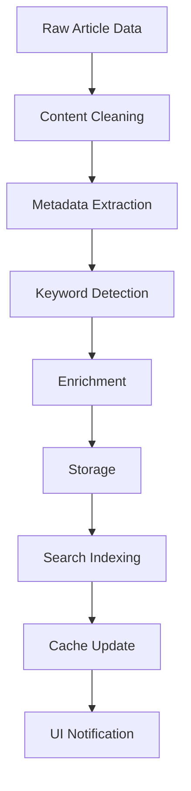

# Backend Architecture

## Service Layer Architecture

```swift
// Service Protocol Definitions
protocol ServiceProtocol {
    associatedtype Input
    associatedtype Output
    func execute(_ input: Input) async throws -> Output
}

// Dependency Injection Container
class ServiceContainer {
    static let shared = ServiceContainer()
    
    lazy var networkManager = NetworkManager()
    lazy var databaseManager = SQLiteManager()
    lazy var fetchCoordinator = FetchCoordinator()
    lazy var keywordEngine = KeywordMatchingEngine()
    lazy var cacheManager = CacheManager()
    
    // Repositories
    lazy var articleRepository = ArticleRepository(db: databaseManager)
    lazy var sourceRepository = SourceRepository(db: databaseManager)
    lazy var keywordRepository = KeywordRepository(db: databaseManager)
    
    // Services
    lazy var rssFeedService = RSSFeedService(network: networkManager)
    lazy var webScrapingService = WebScrapingService()
    lazy var aiService = AIIntegrationService() // Phase 2
}
```

## Concurrency Architecture

```swift
// Actor-based Concurrency Model
actor FetchCoordinator {
    private var activeFetches: Set<UUID> = []
    private let maxConcurrent = 5
    
    func fetchAllSources() async {
        let sources = await sourceRepository.getEnabled()
        
        await withTaskGroup(of: FetchResult.self) { group in
            for source in sources {
                group.addTask { [self] in
                    await self.fetchSource(source)
                }
            }
            
            for await result in group {
                await processResult(result)
            }
        }
    }
    
    private func fetchSource(_ source: Source) async -> FetchResult {
        // Rate limiting
        await rateLimiter.waitIfNeeded(for: source.url)
        
        switch source.type {
        case .rss:
            return await rssFeedService.fetch(source)
        case .website:
            return await webScrapingService.fetch(source)
        case .api:
            return .failure(NotImplementedError())
        }
    }
}
```

## Data Processing Pipeline



## Error Handling Architecture

```swift
enum AppError: LocalizedError {
    case network(NetworkError)
    case database(DatabaseError)
    case parsing(ParsingError)
    case ai(AIError)
    case validation(ValidationError)
    
    var errorDescription: String? {
        switch self {
        case .network(let error):
            return "Network error: \(error.localizedDescription)"
        case .database(let error):
            return "Database error: \(error.localizedDescription)"
        case .parsing(let error):
            return "Parsing error: \(error.localizedDescription)"
        case .ai(let error):
            return "AI service error: \(error.localizedDescription)"
        case .validation(let error):
            return "Validation error: \(error.localizedDescription)"
        }
    }
    
    var recoverySuggestion: String? {
        switch self {
        case .network:
            return "Check your internet connection and try again"
        case .database:
            return "Try restarting the application"
        case .parsing:
            return "The source format may have changed"
        case .ai:
            return "AI features temporarily unavailable"
        case .validation:
            return "Please check your input and try again"
        }
    }
}

// Result type for service operations
typealias ServiceResult<T> = Result<T, AppError>
```

## Background Task Management

```swift
class BackgroundTaskScheduler {
    private var tasks: [UUID: DispatchWorkItem] = [:]
    private let queue = DispatchQueue(label: "background.tasks", qos: .background)
    
    func scheduleFetch(at dates: [Date]) {
        for date in dates {
            let task = DispatchWorkItem { [weak self] in
                Task {
                    await self?.executeFetch()
                }
            }
            
            let delay = date.timeIntervalSinceNow
            if delay > 0 {
                queue.asyncAfter(deadline: .now() + delay, execute: task)
                tasks[UUID()] = task
            }
        }
    }
    
    func scheduleCleanup() {
        let task = DispatchWorkItem { [weak self] in
            Task {
                await self?.cleanOldArticles()
                await self?.vacuumDatabase()
                await self?.clearCache()
            }
        }
        
        // Run daily at 3 AM
        let calendar = Calendar.current
        let targetTime = calendar.dateComponents([.hour, .minute], from: Date(hour: 3, minute: 0))
        // Schedule recurring task
    }
}
```

## Caching Strategy

```swift
class CacheManager {
    // Three-tier caching
    private let memoryCache = NSCache<NSString, CacheEntry>()
    private let diskCache = DiskCache(directory: .caches)
    private let databaseCache: ArticleRepository
    
    func get<T: Codable>(_ key: String, type: T.Type) async -> T? {
        // L1: Memory
        if let cached = memoryCache.object(forKey: key as NSString) {
            return cached.value as? T
        }
        
        // L2: Disk
        if let data = await diskCache.read(key) {
            let decoded = try? JSONDecoder().decode(T.self, from: data)
            memoryCache.setObject(CacheEntry(decoded), forKey: key as NSString)
            return decoded
        }
        
        // L3: Database
        return nil
    }
    
    func set<T: Codable>(_ value: T, for key: String, ttl: TimeInterval = 3600) async {
        let entry = CacheEntry(value, ttl: ttl)
        memoryCache.setObject(entry, forKey: key as NSString)
        
        if let data = try? JSONEncoder().encode(value) {
            await diskCache.write(data, for: key)
        }
    }
}
```
