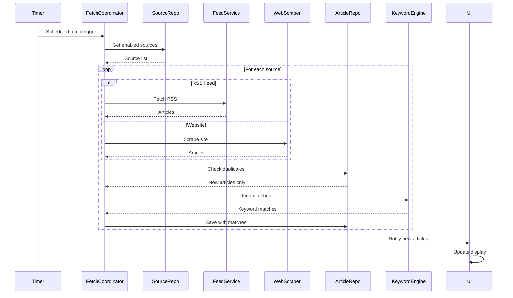
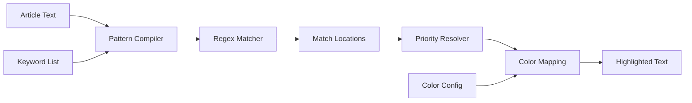
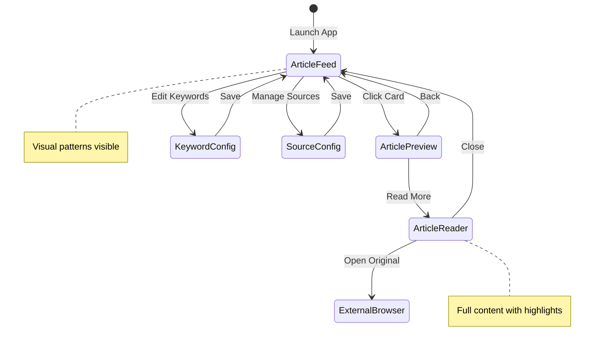
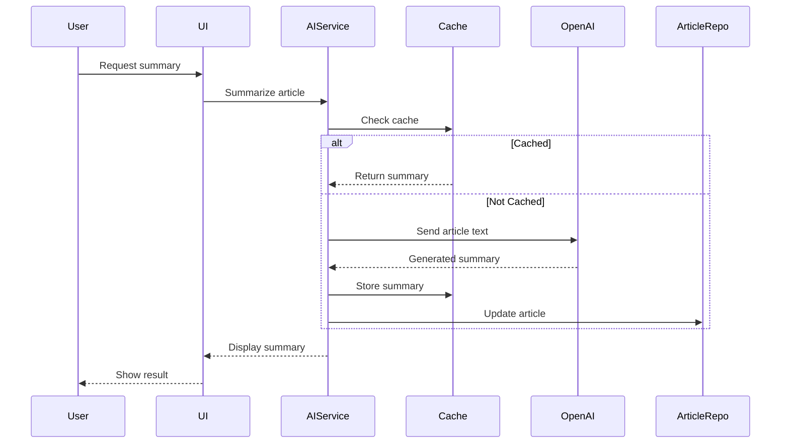
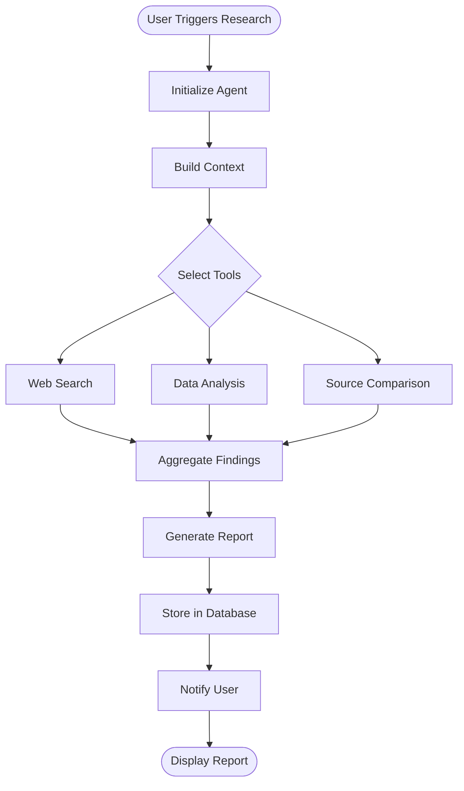

# Core Workflows

## Article Fetch Workflow

```mermaid
sequenceDiagram
    participant Timer
    participant FetchCoordinator
    participant SourceRepo
    participant FeedService
    participant WebScraper
    participant ArticleRepo
    participant KeywordEngine
    participant UI
    
    Timer->>FetchCoordinator: Scheduled fetch trigger
    FetchCoordinator->>SourceRepo: Get enabled sources
    SourceRepo-->>FetchCoordinator: Source list
    
    loop For each source
        alt RSS Feed
            FetchCoordinator->>FeedService: Fetch RSS
            FeedService-->>FetchCoordinator: Articles
        else Website
            FetchCoordinator->>WebScraper: Scrape site
            WebScraper-->>FetchCoordinator: Articles
        end
        
        FetchCoordinator->>ArticleRepo: Check duplicates
        ArticleRepo-->>FetchCoordinator: New articles only
        FetchCoordinator->>KeywordEngine: Find matches
        KeywordEngine-->>FetchCoordinator: Keyword matches
        FetchCoordinator->>ArticleRepo: Save with matches
    end
    
    ArticleRepo->>UI: Notify new articles
    UI->>UI: Update display
```

## Keyword Matching Workflow

```mermaid
flowchart LR
    A[Article Text] --> B[Pattern Compiler]
    B --> C[Regex Matcher]
    C --> D[Match Locations]
    D --> E[Priority Resolver]
    E --> F[Color Mapping]
    F --> G[Highlighted Text]
    
    H[Keyword List] --> B
    I[Color Config] --> F
```

## User Reading Flow

```mermaid
stateDiagram-v2
    [*] --> ArticleFeed: Launch App
    ArticleFeed --> ArticlePreview: Click Card
    ArticlePreview --> ArticleReader: Read More
    ArticlePreview --> ArticleFeed: Back
    ArticleReader --> ExternalBrowser: Open Original
    ArticleReader --> ArticleFeed: Close
    
    ArticleFeed --> KeywordConfig: Edit Keywords
    KeywordConfig --> ArticleFeed: Save
    
    ArticleFeed --> SourceConfig: Manage Sources
    SourceConfig --> ArticleFeed: Save
    
    note right of ArticleFeed: Visual patterns visible
    note right of ArticleReader: Full content with highlights
```

## AI Summarization Workflow (Phase 2)

```mermaid
sequenceDiagram
    participant User
    participant UI
    participant AIService
    participant Cache
    participant OpenAI
    participant ArticleRepo
    
    User->>UI: Request summary
    UI->>AIService: Summarize article
    AIService->>Cache: Check cache
    
    alt Cached
        Cache-->>AIService: Return summary
    else Not Cached
        AIService->>OpenAI: Send article text
        OpenAI-->>AIService: Generated summary
        AIService->>Cache: Store summary
        AIService->>ArticleRepo: Update article
    end
    
    AIService-->>UI: Display summary
    UI-->>User: Show result
```

## Research Agent Workflow (Phase 2)

```mermaid
flowchart TB
    Start([User Triggers Research])
    Start --> Init[Initialize Agent]
    Init --> Context[Build Context]
    Context --> Tools{Select Tools}
    
    Tools --> Web[Web Search]
    Tools --> Analysis[Data Analysis]
    Tools --> Comparison[Source Comparison]
    
    Web --> Aggregate[Aggregate Findings]
    Analysis --> Aggregate
    Comparison --> Aggregate
    
    Aggregate --> Report[Generate Report]
    Report --> Store[Store in Database]
    Store --> Notify[Notify User]
    Notify --> End([Display Report])
```
