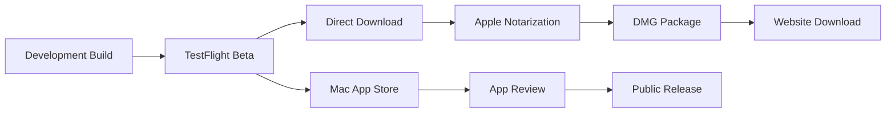

# Deployment Architecture

## Distribution Strategy



## Build Configuration

```swift
// Build Configurations
enum BuildConfiguration {
    case debug
    case release
    case appStore
    
    var bundleIdentifier: String {
        switch self {
        case .debug: return "com.yourcompany.desktop-news-aggregator.debug"
        case .release: return "com.yourcompany.desktop-news-aggregator"
        case .appStore: return "com.yourcompany.desktop-news-aggregator"
        }
    }
    
    var apiEndpoint: String? {
        switch self {
        case .debug: return "http://localhost:8765"
        case .release, .appStore: return nil // Local only for MVP
        }
    }
}
```

## Code Signing & Notarization

```bash