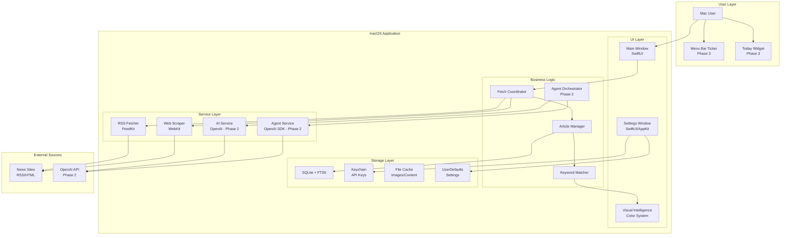

# High Level Architecture

## Technical Summary

The Desktop News Aggregator employs a monolithic native macOS architecture using Swift/SwiftUI, designed for rapid MVP delivery within 2-3 weeks. The application fetches content from 10-15 news sources via RSS/web scraping, stores articles in local SQLite with FTS5 for full-text search, and presents them through a card-based UI with proprietary color-coded keyword visualization. The architecture prioritizes local processing and storage for the MVP, with clear extension points for OpenAI integration and agent capabilities in Phase 2. This approach achieves the PRD goals of reducing news consumption time by 60% through instant visual pattern recognition while maintaining native performance on both Intel and Apple Silicon Macs.

## Platform and Infrastructure Choice

**Platform:** Local macOS Application (MVP), Local + Cloud Hybrid (Phase 2)
**Key Services:** 
- MVP: Local SQLite, File System Storage, macOS Keychain
- Phase 2: OpenAI API for summarization, OpenAI Agents SDK for research
- Phase 3: CloudKit for sync, App Store Connect for distribution
**Deployment Host and Regions:** Direct download (MVP), Mac App Store (Phase 3), Single binary distribution

## Repository Structure

**Structure:** Monorepo
**Monorepo Tool:** Xcode workspace with Swift Package Manager
**Package Organization:** 
- Single Xcode project with logical folder structure
- Core/ (business logic, models, data access)
- UI/ (SwiftUI views, AppKit components)
- Services/ (fetching, parsing, AI integration)
- Storage/ (SQLite, caching, persistence)
- Utilities/ (shared helpers, extensions)

## High Level Architecture Diagram

## Architectural Patterns

- **Monolithic Architecture:** Single macOS application bundle with modular internal structure - *Rationale:* Simplifies deployment and reduces complexity for solo developer MVP
- **MVVM Pattern:** Model-View-ViewModel with Combine for reactive updates - *Rationale:* Native SwiftUI pattern ensuring clean separation of concerns and testability
- **Repository Pattern:** Abstract data access through protocol-based repositories - *Rationale:* Enables future migration from SQLite to Core Data or CloudKit without UI changes
- **Coordinator Pattern:** Centralized fetch orchestration and navigation - *Rationale:* Manages complex async operations and maintains single responsibility principle
- **Observer Pattern:** Combine publishers for real-time UI updates - *Rationale:* Efficient propagation of article updates and keyword matches across views
- **Strategy Pattern:** Source-specific fetchers (RSS, Web, API) behind common protocol - *Rationale:* Extensible architecture for adding new source types without modifying core logic
- **Facade Pattern:** Simplified AI service interface hiding OpenAI complexity - *Rationale:* Isolates AI implementation details and enables easy model switching
- **Decorator Pattern:** Keyword highlighting as view modifier - *Rationale:* Reusable highlighting logic across different text components
